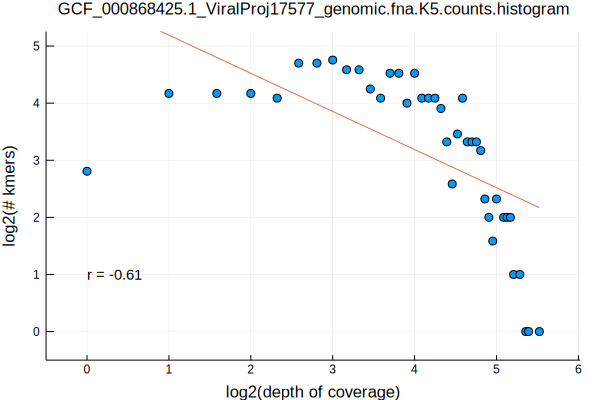
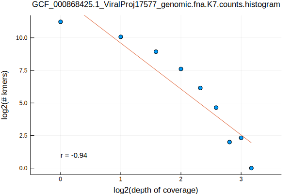
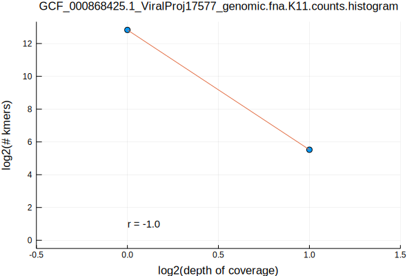
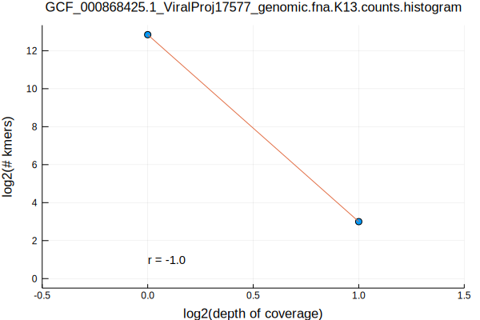
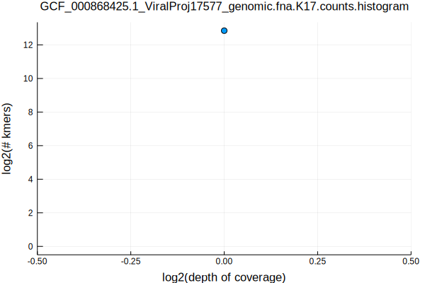

In the [previous post](/selecting-genomes-by-taxonomy.html) we integrated taxonomic information with the RefSeq reference genomes to select a set of representative genomes from each taxonomic category. In this post, we will evaluate the kmer frequency profiles of the selected virus, the Norwalk virus. 

The first step in analyzing the frequency of kmers is to first determine all of the kmers in a genome. This can be done by simply starting at the beginning of the genome and then returning each k-length slice from the genome. If the genome is composed of multiple chromosomes, then the process is the same, but it is done chromosome by chromosome. Depending on the context of the question you are interested in, you may wish to review the kmers as they are actually observed, or you may wish to convert all kmers to their canonical form. The canonical form is jargon for whichever orientation is alphabetically first.

I have written a function to do this in the [Eisenia](https://github.com/cjprybol/Eisenia) package, which can be accessed as a standalone command line function.


```julia
genomes_directory = joinpath(dirname(pwd()), "datasets", "refseq_reference_genomes")
fasta_file_base = "GCF_000868425.1_ViralProj17577_genomic.fna"
fasta_path_base = joinpath(genomes_directory, fasta_file_base)
run(pipeline(`Eisenia stream-kmers --k 3 --fasta $fasta_path_base.gz`))
```

    CAC
    TCA
    GAA
    AAA
    AAT
    ATG
    TCA
    CTC
    AGG
    GGA
    ATC
    ATG
    CCA
    GCC
    GCA
    CAA
    AAC
    ACG
    CGC
    GCC
    CCA
    ATG
    ATC
    AGA
    AAG
    GAA
    AGA
    CAG
    GCA
    CGC
    CGC
    GCC
    CCC
    AGG
    CTC
    AGA
    CAG
    ACA
    CAC
    GCA
    CGC
    CGC
    GCA
    CAA
    AAC
    ACA
    CAC
    ACA
    CAG
    AGA
    CTC
    AGA
    GAA
    AAA
    AAC
    ACG
    CGC
    GCA
    CAA
    AAA
    AAA
    AAA
    AAC
    ACA
    CAA
    AAG
    AGA
    GAA
    AAG
    AGG
    GCC
    AGC
    AAG
    GAA
    CGA
    ACG
    GAC
    AGA
    CTA
    TAA
    AAA
    AAG
    AGC
    AGC
    CTA
    CTA
    ACT
    CAC
    ACA
    GAC
    AGA
    CTC
    GGA
    AGG
    AAG
    AAA
    CAA
    CCA
    GGA
    CTC
    AGC
    GCA
    CAC
    ACC
    AGG
    CTA
    CTA
    AGC
    GCC
    CCC
    CCC
    CCC
    AGG
    CTC
    AGA
    CTC
    AGA
    AAG
    GAA
    CGA
    CCG
    GGA
    CTC
    AGA
    CTC
    AGC
    CGC
    CGA
    GAA
    AAG
    AGA
    GAC
    ACG
    CGA
    GAA
    AAA
    AAT
    AAT
    TAA
    TAA
    AAT
    AAT
    TAA
    GTA
    ACA
    ATG
    ATG
    TCA
    GAC
    ACC
    CCC
    CCC
    AGG
    CTC
    GGA
    AGG
    CAG
    TCA
    CTC
    AGC
    GCA
    CAG
    AGG
    GGA
    GAA
    AAG
    AGC
    AGC
    CTC
    TCA
    CAG
    AGC
    GCC
    CCC
    CCG
    CCG
    GCC
    CGC
    CGC
    GCC
    CCC
    AGG
    AAG
    CAA
    GCA
    CGC
    CCG
    GCC
    GCC
    CCC
    AGG
    AAG
    GAA
    TCA
    ATG
    ATG
    GCA
    CGC
    CCG
    GGA
    GAA
    AAG
    AGG
    CCC
    GCC
    GCC
    CCG
    CGC
    AGC
    AAG
    CAA
    GCA
    GCC
    CCG
    CCG
    CCC
    GCC
    AGC
    CTC
    GGA
    CCC
    CCC
    CCG
    ACG
    CAC
    TCA
    GAC
    ACG
    CGC
    CGC
    ACG
    GTA
    CTA
    ACT
    CAC
    TCA
    ATC
    ATG
    GCA
    GCA
    CAC
    ACG
    CGC
    CGC
    ACG
    CAC
    GCA
    AGC
    CAG
    TCA
    ATC
    ATC
    AGA
    AAG
    GAA
    TCA
    CAA
    AAT
    ATG
    TCA
    CTC
    ACT
    CAC
    CCA
    CCC
    GGA
    CTC
    AGG
    GGA
    CTC
    AGA
    CTC
    AGG
    GGA
    GAA
    AAG
    AGA
    GAA
    AAG
    ACT
    GAC
    AGA
    CAG
    TCA
    ATC
    ATC
    GGA
    CCG
    ACG
    CAC
    CCA
    GCC
    AGC
    CTA
    GTA
    ACG
    CCG
    GCC
    AGC
    CAG
    CCA
    GGA
    GAC
    ACA
    ATG
    ATG
    ACA
    GAC
    AGA
    CAG
    TCA
    ATC
    ATA
    TAA
    AAG
    AGG
    GCC
    AGC
    CTA
    ATA
    ATC
    AGA
    AAG
    GAA
    GGA
    CCG
    CGC
    GCC
    CCG
    ACG
    AAC
    TAA
    GTA
    ACC
    CCC
    CCC
    CCC
    CCA
    ATG
    ATC
    AGA
    CAG
    GCA
    CGC
    CCG
    GCC
    GCC
    AGG
    CTA
    TAA
    AAG
    AGG
    GGA
    CTC
    AGG
    GGA
    ATC
    ATA
    CTA
    AGG
    GCC
    GCC
    AGG
    CAG
    TCA
    GAC
    ACG
    CGC
    CGC
    CGC
    GCC
    CCC
    AGG
    CTC
    GGA
    CCC
    CCA
    ATG
    ATG
    GCA
    CGC
    CCG
    GGA
    CTC
    AGG
    GGA
    GAC
    ACG
    CGC
    AGC
    CTA
    ATA
    ATG
    CCA
    GGA
    ATC
    ATG
    GCA
    GCC
    CCA
    CAA
    AAG
    AGG
    GGA
    CTC
    AGC
    GCC
    AGG
    CAG
    ACA
    CAC
    TCA
    ATC
    ATC
    CGA
    CCG
    GCC
    AGC
    CTC
    AGA
    CTA
    ATA
    ATC
    AGA
    AAG
    CAA
    CCA
    GGA
    CTC
    AGC
    GCA
    CAG
    AGG
    GGA
    ATC
    ATG
    TCA
    ATC
    ATC
    TCA
    CAC
    ACA
    CAA
    AAG
    ACT
    AAC
    AAA
    AAA
    TAA
    GTA
    ACC
    CCA
    ATG
    AAT
    TAA
    GTA
    ACT
    CTC
    AGA
    CAG
    ACA
    GAC
    AGA
    CTA
    GTA
    ACA
    ATG
    ATC
    CGA
    CCG
    ACC
    CAC
    CCA
    GCC
    CGC
    CCG
    GCC
    GCC
    AGG
    AAG
    CAA
    ACA
    CAC
    TCA
    ATC
    ATG
    CCA
    CCC
    CCC
    CCC
    ACC
    GAC
    TCA
    CAA
    AAC
    ACA
    CAA
    AAC
    ACC
    CCC
    CCC
    CCA
    CAG
    ACT
    CAC
    GCA
    AGC
    CAG
    GCA
    CGC
    CCG
    ACC
    GAC
    AGA
    CAG
    GCA
    GCC
    CCA
    CAG
    AGG
    GCC
    GCA
    CAA
    AAC
    ACG
    CGA
    ATC
    AAT
    CAA
    TCA
    ATC
    ATG
    ACA
    CAC
    CCA
    GGA
    CTC
    AGA
    GAA
    AAG
    AGC
    AGC
    CTA
    GTA
    ACA
    CAC
    ACC
    AGG
    CTC
    AGA
    CAG
    CCA
    ACC
    CAC
    CCA
    GCC
    CGC
    CCG
    GCC
    GCC
    AGG
    CAG
    ACA
    GAC
    AGA
    CAG
    CCA
    CCC
    GGA
    CTC
    AGC
    GCC
    CCC
    CCC
    CCG
    CGC
    GCC
    CCA
    ATG
    ATC
    GGA
    CCC
    CCC
    AGG
    AAG
    CAA
    TCA
    GAC
    ACT
    CTC
    CGA
    CCG
    GCC
    AGC
    CAG
    TCA
    CTC
    ACT
    AAC
    CAA
    TCA
    CTC
    AGG
    GGA
    GAA
    AAG
    ACT
    CAC
    GCA
    CGC
    ACG
    CAC
    CCA
    CCC
    GCC
    GCA
    ATG
    ATG
    TCA
    GAC
    ACT
    CAG
    ACA
    GAC
    GGA
    CCC
    CCC
    AGG
    CTA
    GTA
    ACG
    ACG
    CAC
    CCA
    GCC
    GCC
    CCA
    CAC
    ACC
    CCA
    CAC
    ACC
    CCG
    ACG
    GAC
    TCA
    CAA
    AAC
    ACT
    CAG
    ACA
    AAC
    TAA
    ATA
    ATC
    TCA
    CAG
    AGG
    ACC
    GAC
    AGA
    CAG
    GCA
    AGC
    CAG
    GCA
    AGC
    CAG
    CCA
    GGA
    ATC
    AAT
    CAA
    ACA
    AAC
    CAA
    CCA
    GCC
    GCA
    ATG
    ATC
    TCA
    CAA
    AAG
    AGG
    GGA
    GAC
    ACA
    CAC
    ACC
    AGG
    CAG
    CCA
    GCC
    AGC
    CAG
    TCA
    GAA
    AAG
    AGA
    CTC
    AGG
    CCC
    GCC
    CGC
    CGA
    GAA
    AAG
    AGA
    ATC
    ATC
    AGA
    CTC
    AGA
    CTA
    CTA
    AGA
    CTC
    AGA
    ATC
    ATC
    AGA
    CAG
    GCA
    GCC
    CCC
    AGG
    AAG
    GAA
    AGA
    CTA
    GTA
    ACA
    CAG
    AGC
    GCC
    CCC
    CCC
    CCG
    ACG
    GAC
    GGA
    CCA
    CAG
    AGG
    GGA
    GAC
    ACT
    CAG
    CCA
    GGA
    GAA
    AAC
    ACG
    ACG
    GAC
    CGA
    CGA
    GAC
    ACC
    CCC
    CCC
    CCC
    CCA
    CAG
    AGG
    GGA
    CTC
    AGC
    GCC
    CCC
    AGG
    AAG
    GAA
    TCA
    ATG
    AAT
    GAA
    GGA
    CCA
    ATG
    ATC
    GGA
    CCA
    CAA
    AAG
    AGC
    AGC
    CTC
    TCA
    CAG
    AGG
    GGA
    ATC
    ATG
    CCA
    ACC
    GAC
    AGA
    CTC
    CGA
    CCG
    GGA
    ATC
    ATG
    CCA
    GCC
    GCA
    ATG
    ATC
    GGA
    AGG
    CAG
    CCA
    ACC
    CAC
    CCA
    GCC
    GCC
    AGG
    AAG
    CAA
    ACA
    GAC
    CGA
    CCG
    GCC
    GCA
    CAG
    ACT
    CAC
    TCA
    ATC
    AAT
    CAA
    CCA
    GCC
    GCC
    CCG
    CCG
    GCC
    GCC
    CCA
    CAA
    AAT
    AAT
    TAA
    TAA
    AAG
    AGA
    GAA
    AAC
    ACC
    AGG
    CTA
    GTA
    ACT
    CAG
    CCA
    GCC
    GCC
    AGG
    CTC
    TCA
    CAG
    ACT
    AAC
    TAA
    TAA
    AAG
    AGC
    GCC
    CCG
    CGC
    AGC
    CTC
    TCA
    CAA
    AAC
    ACA
    ATG
    AAT
    GAA
    AGA
    CTC
    TCA
    CAA
    AAC
    ACA
    ATG
    ATC
    CGA
    ACG
    CAC
    GCA
    AGC
    CAG
    TCA
    CTC
    AGC
    AGC
    CAG
    ACA
    CAC
    TCA
    ATC
    AAT
    CAA
    CCA
    GGA
    GAC
    ACC
    AGG
    AAG
    AAA
    AAA
    GAA
    CGA
    CCG
    CCC
    GCC
    GCA
    ATG
    AAT
    CAA
    ACA
    GAC
    TCA
    CAA
    AAT
    ATG
    GCA
    GCC
    CCC
    AGG
    CAG
    TCA
    ATC
    ATC
    AGA
    AAG
    CAA
    GCA
    AGC
    AAG
    CAA
    GCA
    AGC
    CAG
    TCA
    CTC
    AGC
    AGC
    CTC
    AGA
    AAG
    AAA
    CAA
    TCA
    GAC
    ACA
    ATG
    ATC
    AGA
    AAG
    AAA
    AAA
    CAA
    CCA
    GGA
    GAC
    ACC
    CCC
    CCC
    CCC
    CCC
    CCC
    AGG
    CAG
    TCA
    ATC
    ATG
    ACA
    CAC
    TCA
    GAC
    ACC
    CCA
    CAA
    AAC
    ACT
    CAG
    CCA
    GGA
    ATC
    ATG
    TCA
    ATC
    ATC
    AGA
    CTC
    AGA
    CTA
    ATA
    ATC
    AGA
    AAG
    GAA
    CGA
    CCG
    CCC
    CCC
    GGA
    GAA
    AAT
    ATG
    CCA
    GCC
    GCA
    CAG
    AGG
    GCC
    GCC
    CCG
    CGA
    GAA
    AAG
    AGG
    CCC
    GCC
    GCC
    CCC
    AGG
    AAG
    GAA
    CGA
    CGA
    GAC
    ACC
    AGG
    AAG
    CAA
    GCA
    AGC
    CTC
    AGA
    AAG
    CAA
    TCA
    GAC
    ACG
    ACG
    CAC
    CCA
    ACC
    CAC
    GCA
    GCC
    CCC
    CCA
    CAC
    ACC
    CCC
    AGG
    CAG
    ACA
    AAC
    CAA
    CCA
    CCC
    GCC
    CGC
    CCG
    CCC
    GGA
    ATC
    ATC
    CGA
    CCG
    CCC
    GGA
    ATC
    ATG
    CCA
    GCC
    AGC
    AAG
    AAA
    AAA
    CAA
    CCA
    GCC
    GCC
    AGG
    CTC
    TCA
    CAC
    ACC
    AGG
    CTC
    AGA
    CAG
    TCA
    CTC
    AGA
    GAC
    ACC
    CCA
    ATG
    ATC
    CGA
    CCG
    CCC
    GCC
    CGC
    CGC
    GCA
    CAA
    AAG
    AGC
    AGC
    CTC
    CGA
    CGC
    AGC
    AAG
    GAA
    GGA
    CCA
    CAC
    ACC
    CCA
    CAA
    AAC
    ACT
    CTC
    CGA
    CCG
    GCC
    AGC
    CTC
    AGA
    CTC
    TCA
    CAA
    AAG
    AGG
    GCC
    GCC
    CCG
    CGC
    GCC
    CCC
    CCA
    CAA
    AAG
    AGA
    CTC
    AGA
    ATC
    ATG
    CCA
    CCC
    GCC
    GCA
    CAA
    AAG
    ACT
    AAC
    GAA
    CGA
    CGC
    GCC
    CCA
    ATG
    ATA
    CTA
    AGA
    CTC
    AGG
    ACC
    GAC
    AGA
    AAG
    GAA
    TCA
    CAA
    AAG
    AGC
    GCA
    CAA
    AAA
    AAT
    AAT
    TAA
    ATA
    ATG
    CCA
    GCC
    GCC
    AGG
    CAG
    CCA
    GGA
    ATC
    ATC
    AGA
    CAG
    CCA
    GCC
    GCC
    CCC
    AGG
    CTC
    AGA
    CAG
    TCA
    CTC
    AGG
    GGA
    GAC
    ACC
    CCC
    CCA
    CAG
    ACT
    CAC
    GCA
    GCC
    CCA
    CAG
    AGC
    GCC
    CCC
    AGG
    CTC
    AGA
    AAG
    TAA
    ATA
    ATC
    GGA
    CCA
    CAA
    AAC
    ACA
    ATG
    ATG
    CCA
    GGA
    CTC
    AGC
    GCA
    CAG
    AGG
    GCC
    GCC
    CCA
    ATG
    ATC
    TCA
    ATG
    AAT
    TAA
    TAA
    AAG
    AGA
    GAA
    AAT
    ATG
    TCA
    CTC
    ACT
    CAC
    ACA
    GAC
    TCA
    CAA
    AAC
    ACT
    CAG
    CCA
    GGA
    CTC
    AGA
    GAA
    AAC
    ACC
    CCA
    CAA
    AAC
    ACT
    CTC
    TCA
    CAC
    ACG
    CCG
    GCC
    GCC
    CCA
    ATG
    ATG
    ACA
    AAC
    CAA
    GCA
    CGC
    CCG
    CCC
    GGA
    ATC
    ATC
    CGA
    CGC
    GCA
    CAA
    AAC
    ACG
    CGC
    GCA
    CAG
    AGG
    CCC
    CCC
    GCC
    AGC
    CAG
    TCA
    GAA
    AAT
    AAT
    GAA
    GGA
    AGG
    CTA
    TAA
    AAG
    AGG
    ACC
    GAC
    GGA
    CCC
    AGG
    AAG
    CAA
    TCA
    ATC
    ATG
    TCA
    CTC
    AGG
    GGA
    CTC
    AGG
    GGA
    CTC
    AGC
    GCA
    CAG
    AGG
    GGA
    GAA
    AAG
    ACT
    GAC
    GGA
    CCG
    CGC
    GCA
    CAA
    AAG
    AGA
    ATC
    ATC
    CGA
    CGC
    GCA
    CAG
    AGC
    AGC
    CTA
    TAA
    AAG
    ACT
    CAC
    GCA
    CGC
    CCG
    GCC
    GCA
    CAA
    AAC
    ACT
    CTC
    CGA
    CCG
    GCC
    GCC
    CCA
    CAC
    ACC
    CCA
    CAC
    ACT
    CAG
    CCA
    GGA
    GAA
    AAC
    ACC
    CCA
    CAC
    ACC
    CCA
    CAA
    AAC
    ACG
    CGC
    AGC
    CTC
    AGA
    CAG
    GCA
    AGC
    CAG
    CCA
    GCC
    GCC
    CCA
    CAG
    AGG
    GGA
    ATC
    ATC
    TCA
    CAG
    AGC
    GCA
    ATG
    ATG
    CCA
    GCC
    GCC
    CCC
    CCG
    CGC
    CGC
    CGC
    CGC
    CCG
    GCC
    GCC
    AGG
    AAG
    AAA
    CAA
    TCA
    CTC
    AGA
    GAA
    AAA
    AAG
    AGC
    AGC
    CTC
    CGA
    CGC
    CGC
    CGC
    AGC
    CAG
    TCA
    GAA
    AAC
    ACA
    CAG
    AGA
    GAC
    ACC
    AGG
    CTC
    GGA
    CCC
    CCG
    CGA
    CTC
    ACT
    GAC
    GGA
    CCG
    CGC
    GCC
    CCC
    AGG
    CAG
    ACA
    CAC
    CCA
    ACC
    CAC
    TCA
    ATC
    ATC
    TCA
    ATG
    ATG
    CCA
    ACC
    GAC
    AGA
    CTC
    TCA
    CAG
    AGG
    GCC
    GCA
    CAG
    AGG
    GCC
    GCC
    CCC
    CCG
    CCG
    CCC
    GGA
    ATC
    ATC
    CGA
    CCG
    CCC
    GGA
    GAA
    AAA
    AAA
    AAC
    ACC
    AGG
    CAG
    GCA
    AGC
    AAG
    AAA
    AAA
    CAA
    GCA
    GCC
    CCA
    CAA
    AAA
    AAA
    AAC
    ACC
    AGG
    CAG
    CCA
    GCC
    GCC
    CCA
    CAA
    AAG
    AGA
    CTC
    AGG
    GGA
    ATC
    AAT
    CAA
    GCA
    AGC
    CAG
    GCA
    CGC
    ACG
    GAC
    GGA
    CCC
    AGG
    CAG
    CCA
    CCC
    ACC
    CAC
    TCA
    ATC
    ATG
    TCA
    CTC
    AGA
    GAC
    ACC
    AGG
    CTC
    AGA
    CAG
    ACA
    AAC
    CAA
    CCA
    GCC
    GCA
    ATG
    ATC
    TCA
    ATG
    ATA
    GTA
    ACC
    CCA
    CAC
    ACG
    CGC
    CGC
    CGC
    AGC
    CAG
    TCA
    ATC
    ATG
    ACA
    GAC
    CGA
    CGA
    GAC
    ACC
    CCA
    CAC
    ACT
    CAG
    CCA
    CCC
    GGA
    ATC
    ATG
    GCA
    AGC
    AAG
    TAA
    GTA
    ACA
    CAA
    AAG
    AGG
    CCC
    GGA
    CTC
    AGC
    GCC
    CCA
    CAG
    AGA
    CTC
    ACT
    CAC
    CCA
    ACC
    AAC
    GAA
    AGA
    CTC
    AGA
    CAG
    CCA
    CCC
    GGA
    ATC
    ATG
    TCA
    ATC
    AAT
    AAA
    GAA
    CGA
    CCG
    GCC
    GCA
    ATG
    ATG
    CCA
    GGA
    GAC
    ACA
    CAA
    AAC
    ACG
    ACG
    CAC
    CCA
    ACC
    CAC
    TCA
    GAA
    AAG
    AGG
    GGA
    ATC
    ATG
    GCA
    GCA
    CAC
    ACT
    CAG
    TCA
    CTC
    AGG
    GCC
    AGC
    AAG
    GAA
    TCA
    CAG
    AGA
    ATC
    ATG
    GCA
    AGC
    AAG
    CAA
    GCA
    GCC
    CCG
    CGA
    GAC
    ACA
    CAC
    ACG
    ACG
    CAC
    GCA
    GCC
    CCC
    CCA
    CAG
    ACT
    CAC
    TCA
    GAC
    ACA
    CAC
    ACT
    CTC
    TCA
    CAA
    AAT
    AAT
    CAA
    ACA
    CAC
    TCA
    GAC
    ACA
    CAG
    AGG
    GGA
    ATC
    AAT
    CAA
    TCA
    CTC
    AGA
    GAA
    AAC
    ACA
    CAA
    AAG
    AGG
    CCC
    GGA
    GAA
    AAA
    AAG
    AGA
    ATC
    ATG
    ACA
    AAC
    AAA
    CAA
    TCA
    GAC
    ACT
    CTC
    AGA
    CTC
    TCA
    CAG
    AGG
    ACC
    GAC
    TCA
    ATG
    AAT
    TAA
    ATA
    ATC
    TCA
    ATG
    ATC
    TCA
    CAC
    ACC
    CCA
    CAC
    ACA
    CAA
    AAA
    AAT
    ATC
    TCA
    CAA
    AAC
    ACA
    CAA
    AAA
    AAC
    ACC
    CCC
    CCC
    CCC
    CCG
    ACG
    CAC
    GCA
    GCC
    CCC
    CCC
    AGG
    CAG
    CCA
    GGA
    GAC
    ACT
    CTA
    ATA
    ATG
    ACA
    GAC
    TCA
    CAA
    AAC
    ACC
    AGG
    CAG
    CCA
    GGA
    CTC
    AGG
    GCC
    CGC
    CCG
    ACC
    GAC
    AGA
    CAG
    GCA
    GCC
    CCG
    CGC
    GCC
    CCG
    CGC
    GCA
    ATG
    ATA
    CTA
    AGA
    ATC
    AAT
    AAA
    GAA
    GGA
    AGG
    CAG
    CCA
    ACC
    AAC
    AAA
    TAA
    ATA
    ATG
    GCA
    AGC
    CAG
    TCA
    CTC
    AGA
    CTC
    AGC
    GCC
    CCC
    AGG
    CAG
    ACA
    AAC
    CAA
    ACA
    AAC
    CAA
    TCA
    ATC
    ATG
    TCA
    ATC
    ATG
    GCA
    AGC
    CTC
    CGA
    CCG
    CCC
    GCC
    GCC
    CCA
    CAG
    AGA
    CTC
    AGC
    GCC
    CCC
    CCC
    AGG
    CAG
    CCA
    GCC
    CGC
    CGA
    ATC
    ATG
    ACA
    CAC
    TCA
    GAA
    AAT
    ATG
    GCA
    GCA
    CAG
    ACT
    CAC
    TCA
    GAA
    AAA
    AAG
    AGC
    AGC
    CAG
    GCA
    GCC
    CCA
    ATG
    ATG
    TCA
    CTC
    AGG
    GCC
    GCC
    CCC
    CCG
    CGA
    ATC
    AAT
    TAA
    GTA
    ACA
    CAG
    AGC
    GCC
    CCA
    CAC
    ACA
    ATG
    ATC
    TCA
    CAA
    AAT
    AAT
    AAA
    GAA
    TCA
    ATG
    ATC
    AGA
    AAG
    CAA
    CCA
    GCC
    GCA
    CAC
    ACC
    CCG
    CGC
    GCA
    CAG
    AGG
    CCC
    GCC
    CGC
    CCG
    GCC
    AGC
    AAG
    AAA
    CAA
    TCA
    GAC
    ACC
    CCG
    ACG
    GAC
    TCA
    CAG
    AGG
    CCC
    GGA
    GAA
    AAA
    AAC
    ACA
    CAC
    ACC
    CCC
    CCC
    CCC
    AGG
    CTA
    GTA
    ACG
    CCG
    ACC
    GTA
    TAA
    AAG
    AGG
    CCC
    GCC
    CGC
    ACG
    GAC
    TCA
    CAC
    ACC
    CCA
    CAA
    AAG
    AGA
    ATC
    ATC
    TCA
    ATG
    AAT
    CAA
    CCA
    GCC
    CGC
    CGC
    GCC
    CCA
    CAC
    ACT
    CAG
    GCA
    AGC
    CTC
    AGA
    AAG
    AAA
    CAA
    GCA
    CGC
    CGC
    CGC
    CGA
    CTC
    AGA
    CTC
    AGC
    CGC
    CCG
    ACC
    AAC
    CAA
    GCA
    AGC
    CTC
    AGA
    AAG
    CAA
    ACA
    GAC
    GGA
    CCA
    ATG
    ATG
    TCA
    CTC
    AGC
    CGC
    CGC
    GCC
    CCA
    ATG
    ATG
    TCA
    ATC
    ATG
    TCA
    ATC
    AAT
    AAA
    GAA
    CGA
    CCG
    GCC
    GCC
    AGG
    CTC
    GGA
    CCA
    CAG
    AGA
    GAA
    AAC
    ACA
    CAA
    AAG
    AGG
    ACC
    GAC
    AGA
    CTA
    ATA
    ATG
    TCA
    GAC
    ACT
    AAG
    AAA
    CAA
    TCA
    ATC
    ATG
    GCA
    GCC
    CCG
    CCG
    GCC
    GCA
    CAA
    AAG
    AGA
    ATC
    ATC
    TCA
    CAC
    ACC
    CCG
    CGC
    GCC
    AGG
    AAG
    GAA
    TCA
    CAA
    AAA
    AAG
    AGC
    GCC
    CCA
    ATG
    ATG
    CCA
    GCC
    CGC
    CCG
    GCC
    AGC
    CAG
    TCA
    GAC
    ACG
    CGC
    GCC
    CCG
    CCG
    GCC
    GCA
    ATG
    AAT
    GAA
    GGA
    CCA
    ATG
    ATG
    CCA
    ACC
    GTA
    GTA
    ACA
    CAA
    AAA
    AAA
    AAT
    ATG
    CCA
    GCC
    GCA
    CAG
    AGC
    AGC
    CTA
    ATA
    AAT
    CAA
    CCA
    CCC
    ACC
    CAC
    GCA
    GCA
    CAA
    AAA
    AAG
    AGC
    GCA
    CAA
    AAT
    ATG
    CCA
    CCC
    CCC
    ACC
    CAC
    GCA
    GCA
    CAC
    ACC
    AGG
    CAG
    ACA
    CAC
    ACA
    GTA
    CTA
    AGA
    CTC
    AGG
    GGA
    CTC
    AGG
    GCC
    GCC
    CCA
    ATG
    ATG
    GCA
    GCA
    ATG
    AAT
    AAA
    TAA
    GTA
    ACT
    AAG
    TAA
    TAA
    AAG
    AGG
    GGA
    ATC
    AAT
    TAA
    ATA
    ATG
    TCA
    CTC
    AGG
    ACC
    CAC
    CCA
    GCC
    AGC
    CTC
    GGA
    CCC
    AGG
    CAG
    ACA
    GAC
    TCA
    CAG
    AGG
    ACC
    CAC
    TCA
    ATC
    ATC
    AGA
    CTA
    GTA
    ACA
    CAA
    AAT
    ATG
    CCA
    ACC
    CAC
    GCA
    GCC
    CCA
    CAC
    ACC
    AGG
    CTA
    ATA
    ATA
    TAA
    AAT
    ATG
    ACA
    CAC
    TCA
    CTC
    AGC
    AGC
    CAG
    GCA
    GCA
    ATG
    ATC
    TCA
    CAA
    AAG
    AGG
    CCC
    ACC
    CAC
    GCA
    GCC
    CCC
    CCC
    CCA
    CAA
    AAT
    ATG
    CCA
    ACC
    AAC
    CAA
    TCA
    GAA
    AAA
    AAA
    AAG
    AGG
    ACC
    GAC
    TCA
    CAA
    AAG
    AGG
    GGA
    CTC
    AGC
    GCC
    AGG
    CAG
    TCA
    GAA
    AAT
    AAT
    CAA
    GCA
    GCC
    CCC
    CCA
    CAA
    AAA
    AAA
    AAC
    ACA
    CAC
    ACT
    AAG
    CAA
    ACA
    GAC
    TCA
    CAA
    AAC
    ACT
    CAG
    ACA
    CAC
    ACA
    GAC
    TCA
    CAG
    AGA
    GAA
    AAG
    AGG
    GGA
    ATC
    ATA
    TAA
    AAA
    AAG
    AGG
    GGA
    CTC
    AGG
    GCC
    GCC
    CCC
    CCG
    CGC
    GCC
    AGG
    CTC
    GGA
    CCG
    CGC
    AGC
    CAG
    GCA
    AGC
    CTA
    GTA
    ACT
    CAG
    ACA
    GTA
    CTA
    AGG
    GGA
    ATC
    ATG
    CCA
    GCC
    AGC
    CAG
    GCA
    AGC
    CAG
    TCA
    GAC
    ACG
    ACG
    GAC
    TCA
    ATG
    ATC
    TCA
    CAC
    ACG
    ACG
    GAC
    GGA
    CCA
    ATG
    AAT
    GAA
    AGA
    CAG
    GCA
    GCA
    CAG
    AGG
    GCC
    CGC
    CCG
    GCC
    GCC
    CCG
    CCG
    GCC
    GCA
    CAC
    ACG
    CCG
    GCC
    GCC
    AGG
    AAG
    GAA
    AGA
    CTC
    AGA
    CTA
    ATA
    AAT
    AAA
    TAA
    GTA
    ACC
    CCA
    CAC
    ACC
    CCA
    CAG
    AGA
    ATC
    AAT
    CAA
    TCA
    CTC
    AGA
    GAA
    AAG
    AGA
    CTC
    AGG
    ACC
    GAC
    AGA
    CTA
    CTA
    AGA
    GAC
    ACC
    CCA
    ATG
    ATC
    GGA
    AGG
    AAG
    AAA
    AAA
    TAA
    ATA
    AAT
    CAA
    CCA
    CCC
    GGA
    ATC
    ATC
    CGA
    ACG
    CAC
    CCA
    GGA
    ATC
    ATA
    GTA
    ACA
    CAC
    ACC
    AGG
    CTA
    GTA
    ACC
    CCG
    ACG
    CAC
    TCA
    GAC
    ACG
    CCG
    GGA
    GAC
    ACC
    AGG
    CAG
    CCA
    GGA
    ATC
    ATC
    GGA
    AGG
    AAG
    AAA
    CAA
    TCA
    GAC
    ACA
    ATG
    ATC
    AGA
    AAG
    AAA
    CAA
    TCA
    CTC
    AGG
    GGA
    ATC
    ATG
    TCA
    GAC
    ACG
    CGA
    ATC
    ATG
    TCA
    ATC
    ATG
    CCA
    CCC
    ACC
    CAC
    CCA
    ACC
    GTA
    GTA
    ACC
    CCA
    CAC
    ACT
    CTC
    AGA
    CAG
    TCA
    CTC
    AGG
    CCC
    GGA
    GAA
    AAA
    AAG
    AGA
    GAA
    AAG
    AGG
    CCC
    GCC
    GCA
    CAA
    AAG
    AGA
    GAA
    AAC
    ACA
    CAA
    AAG
    AGA
    GAA
    AAG
    AGG
    CCC
    GCC
    GCC
    CCG
    CCG
    CCC
    CCC
    CCC
    GCC
    CGC
    CGA
    GAC
    ACC
    CCC
    CCG
    CCG
    GGA
    CTC
    ACT
    GAC
    AGA
    AAG
    GAA
    TCA
    CAG
    AGA
    GAA
    AAC
    ACC
    CCC
    CCG
    ACG
    CAC
    CCA
    CCC
    GCC
    AGC
    CTC
    TCA
    CAC
    ACG
    CCG
    GGA
    ATC
    ATG
    TCA
    CTC
    AGG
    GGA
    CTC
    ACT
    GTA
    GTA
    ACG
    CGA
    ATC
    ATG
    TCA
    GAA
    AAT
    AAT
    GAA
    TCA
    CAA
    AAG
    AGA
    GAA
    AAG
    AGC
    CGC
    CGC
    GCC
    CCG
    CGC
    CGC
    CGA
    CTC
    ACT
    GAC
    AGA
    CTA
    CTA
    AGG
    CCC
    CCC
    GCC
    CGC
    CCG
    GCC
    GCA
    CAA
    AAG
    ACT
    GTA
    GTA
    ACT
    CTC
    GGA
    CCA
    ATG
    AAT
    CAA
    TCA
    ATC
    ATG
    TCA
    ATC
    AAT
    TAA
    GTA
    ACC
    AGG
    CTC
    CGA
    CGC
    AGC
    CAG
    TCA
    GAC
    ACC
    CCG
    CGC
    CGC
    CGA
    CTC
    AGC
    CGC
    CGA
    CTC
    AGA
    GAA
    AAG
    AGA
    GAA
    AAG
    AGA
    GAA
    AAC
    ACT
    CTC
    GGA
    AGG
    CAG
    CCA
    GGA
    CTC
    AGC
    CGC
    CCG
    CCC
    GGA
    GAC
    ACG
    CGA
    CTC
    AGG
    GGA
    CTC
    AGG
    GGA
    CTC
    AGG
    GCC
    AGC
    CTA
    ATA
    ATC
    AGA
    AAG
    GAA
    CGA
    CCG
    CCC
    CCC
    GGA
    ATC
    ATG
    CCA
    GCC
    AGC
    AAG
    GAA
    CGA
    CCG
    CCC
    ACC
    AAC
    CAA
    TCA
    GAA
    AAG
    AGG
    GCC
    GCC
    CCA
    CAC
    ACC
    CCC
    CCG
    CGC
    GCC
    CCG
    ACG
    AAC
    GAA
    GGA
    CCC
    CCG
    CGC
    GCA
    CAA
    AAG
    AGG
    GCC
    GCA
    CAG
    AGA
    CTC
    AGA
    CTC
    AGA
    CTC
    AGC
    GCC
    CCA
    CAA
    AAA
    AAC
    ACT
    CAG
    CCA
    CCC
    GCC
    GCC
    AGG
    CAG
    CCA
    ACC
    AAC
    AAA
    GAA
    AGA
    CAG
    CCA
    ACC
    CAC
    CCA
    GCC
    CGC
    CGA
    GAC
    ACA
    ATG
    ATC
    GGA
    CCG
    CGC
    CGC
    CGC
    GCC
    CCC
    CCG
    CGC
    GCA
    CAA
    AAG
    AGC
    GCC
    CCG
    CGA
    ATC
    ATC
    CGA
    CGA
    GAC
    ACT
    CAG
    CCA
    GGA
    GAA
    AAT
    ATG
    ACA
    CAC
    CCA
    ACC
    AAC
    CAA
    CCA
    GCC
    GCC
    CCC
    CCC
    AGG
    CTC
    GGA
    AGG
    CAG
    CCA
    CCC
    GCC
    AGC
    CAG
    TCA
    GAC
    ACG
    CGA
    ATC
    ATG
    TCA
    GAC
    ACC
    CCG
    CGC
    GCC
    CCA
    CAG
    AGG
    ACC
    GAC
    CGA
    CGA
    GAC
    ACT
    CTA
    GTA
    ACG
    CCG
    GCC
    CGC
    CGA
    CTC
    AGA
    GAA
    AAG
    AGA
    ATC
    ATC
    TCA
    CAA
    AAC
    ACT
    AAG
    AAA
    CAA
    TCA
    CTC
    AGG
    GCC
    GCC
    CCC
    CCC
    CCA
    CAG
    ACT
    GAC
    AGA
    CTC
    GGA
    CCA
    ATG
    ATC
    AGA
    CAG
    CCA
    ACC
    GAC
    GGA
    CCC
    CCG
    ACG
    CAC
    ACA
    AAC
    CAA
    ACA
    CAC
    GCA
    GCA
    CAG
    ACT
    AAC
    GAA
    CGA
    CCG
    GCC
    GCA
    CAC
    ACG
    CCG
    CCC
    CCC
    ACC
    CAC
    CCA
    CCC
    CCC
    GCC
    AGC
    AAG
    AAA
    AAA
    CAA
    CCA
    CCC
    ACC
    CAC
    TCA
    CTC
    AGC
    CGC
    CCG
    GCC
    GCC
    CCA
    CAC
    ACG
    ACG
    GAC
    AGA
    AAG
    GAA
    TCA
    ATG
    ATC
    TCA
    CAC
    ACC
    CCG
    CGC
    GCC
    CCA
    CAA
    AAG
    AGC
    GCA
    ATG
    ATG
    ACA
    CAC
    CCA
    GCC
    CGC
    CGC
    GCC
    CCC
    CCC
    CCC
    CCC
    CCA
    CAA
    AAG
    AGG
    CCC
    GCC
    GCA
    CAC
    ACG
    CCG
    GGA
    CTC
    AGA
    ATC
    ATC
    AGA
    AAG
    AAA
    CAA
    CCA
    CCC
    GCC
    CGC
    CGC
    GCA
    CAA
    AAG
    AGC
    GCC
    CCC
    CCG
    CCG
    CCC
    CCC
    GGA
    GAC
    ACT
    AAG
    GAA
    TCA
    CAC
    ACT
    CAG
    ACA
    GAC
    TCA
    CAC
    ACT
    AAG
    GAA
    GGA
    CCA
    CAG
    AGC
    CGC
    CCG
    CCC
    CCC
    GGA
    GAC
    ACT
    AAG
    GAA
    AGA
    AAG
    CAA
    TCA
    GAA
    AAG
    ACT
    GTA
    GTA
    ACT
    CTA
    GTA
    ACT
    AAG
    GAA
    TCA
    CAC
    ACC
    CCA
    CAG
    AGC
    CGC
    CGC
    GCC
    CCG
    ACG
    GAC
    TCA
    CAG
    AGG
    GCC
    GCC
    AGG
    CAG
    TCA
    GAC
    ACA
    ATG
    AAT
    GAA
    GGA
    CCC
    CCG
    CGC
    GCC
    CCA
    ATG
    ATG
    CCA
    ACC
    GAC
    GGA
    AGG
    CAG
    CCA
    GGA
    CTC
    AGA
    GAA
    AAT
    ATG
    CCA
    CCC
    ACC
    CAC
    GCA
    GCC
    CCA
    CAG
    AGG
    GGA
    CTC
    AGG
    CCC
    GCC
    CGC
    ACG
    GAC
    CGA
    ACG
    GAC
    CGA
    CGC
    GCC
    AGG
    CTC
    CGA
    CCG
    ACC
    GAC
    GGA
    AGG
    AAG
    CAA
    ACA
    GAC
    TCA
    CAA
    AAG
    AGA
    CTC
    AGA
    CTC
    AGC
    GCC
    AGG
    CTC
    GGA
    CCG
    CCG
    GCC
    CGC
    CGA
    CTC
    AGA
    ATC
    ATG
    GCA
    AGC
    AAG
    CAA
    GCA
    GCC
    CCC
    AGG
    CAG
    CCA
    GCC
    AGC
    CAG
    ACA
    GAC
    TCA
    CAG
    AGG
    GGA
    ATC
    ATG
    CCA
    CCC
    ACC
    AAC
    GAA
    TCA
    CAC
    ACA
    CAG
    AGG
    GCC
    GCC
    CCG
    CGC
    GCC
    CCA
    ATG
    ATC
    TCA
    CAA
    AAG
    AGA
    ATC
    AAT
    CAA
    CCA
    ACC
    GTA
    CTA
    ACT
    CAC
    GCA
    GCC
    CCG
    ACG
    AAC
    CAA
    ACA
    CAC
    GCA
    GCA
    ATG
    ATG
    CCA
    CCC
    GCC
    GCA
    CAA
    AAA
    AAC
    ACT
    CAG
    CCA
    GCC
    GCA
    ATG
    ATG
    GCA
    AGC
    CTC
    GGA
    AGG
    CAG
    TCA
    GAC
    ACT
    CAG
    CCA
    GCC
    AGC
    CTC
    AGA
    CTA
    TAA
    AAT
    ATG
    GCA
    GCC
    CCA
    CAA
    AAG
    AGG
    GCC
    GCC
    CCC
    CCA
    CAG
    AGG
    GGA
    GAC
    ACC
    AGG
    CTC
    CGA
    CCG
    CCC
    GGA
    GAC
    ACC
    CCA
    ATG
    ATC
    GGA
    CCC
    CCG
    CCG
    CCC
    GCC
    CGC
    CGA
    GAC
    ACT
    CAG
    ACA
    CAC
    CCA
    GCC
    AGC
    CAG
    ACA
    GAC
    GGA
    CCC
    AGG
    CTA
    ATA
    ATG
    ACA
    AAC
    AAA
    TAA
    ATA
    ATA
    TAA
    AAG
    AGA
    GAA
    AAG
    AGG
    CCC
    ACC
    GTA
    TAA
    AAC
    ACA
    CAC
    ACC
    AGG
    CAG
    CCA
    CCC
    ACC
    AAC
    CAA
    ACA
    CAC
    TCA
    ATC
    AAT
    CAA
    CCA
    CCC
    CCC
    ACC
    CAC
    GCA
    GCA
    CAC
    ACG
    ACG
    CAC
    CCA
    GCC
    CGC
    CCG
    GCC
    GCC
    CCA
    CAC
    ACT
    CTA
    CTA
    AGG
    ACC
    GAC
    AGA
    CAG
    CCA
    ACC
    GTA
    TAA
    AAC
    ACA
    CAC
    ACA
    CAG
    ACT
    GAC
    TCA
    ATG
    AAT
    CAA
    GCA
    GCC
    CCG
    CGC
    GCC
    CCA
    CAC
    ACT
    CTC
    TCA
    CAC
    ACG
    CCG
    GGA
    CTC
    AGA
    GAA
    AAC
    ACC
    CCC
    CCA
    CAC
    ACA
    CAC
    ACT
    AAG
    CAA
    TCA
    CTC
    AGG
    GCC
    AGC
    CTC
    AGA
    CAG
    CCA
    GGA
    CTC
    ACT
    AAC
    GAA
    GGA
    CCA
    CAG
    AGG
    CCC
    GGA
    GAC
    ACC
    CCC
    CCC
    CCC
    CCC
    CCA
    ATG
    ATG
    GCA
    AGC
    AAG
    GAA
    GGA
    CCC
    CCC
    CCG
    CGC
    GCC
    CCC
    CCC
    AGG
    CTC
    TCA
    CAG
    AGG
    GCC
    GCA
    CAC
    ACC
    AGG
    CTA
    ATA
    ATG
    GCA
    GCA
    CAG
    AGG
    GCC
    GCC
    AGG
    CTC
    GGA
    CCC
    CCC
    CCA
    ATG
    ATC
    CGA
    CGC
    GCC
    CCG
    CGA
    ATC
    AAT
    TAA
    GTA
    ACG
    CCG
    GCC
    CGC
    CGA
    GAC
    ACG
    CGC
    AGC
    CTC
    GGA
    CCC
    CCC
    CCC
    CCC
    AGG
    AAG
    CAA
    TCA
    CTC
    AGC
    GCA
    CAC
    ACC
    CCA
    CAA
    AAG
    AGA
    GAC
    ACC
    CCA
    ATG
    ATG
    ACA
    AAC
    GAA
    AGA
    CAG
    CCA
    GCC
    CGC
    ACG
    GTA
    GTA
    ACC
    AGG
    CTC
    CGA
    CGC
    GCC
    CCA
    CAG
    AGA
    CTC
    AGA
    GAA
    AAG
    AGC
    AGC
    AAG
    GAA
    GGA
    CCC
    CCC
    CCC
    AGG
    CAG
    CCA
    CCC
    CCC
    GCC
    AGC
    AAG
    CAA
    CCA
    CCC
    GGA
    CTC
    AGC
    GCC
    CCA
    CAG
    AGC
    GCC
    AGG
    CTA
    ATA
    ATC
    AGA
    CTC
    CGA
    CCG
    GCC
    AGC
    CTC
    AGA
    CTA
    TAA
    AAA
    AAG
    AGA
    ATC
    ATG
    TCA
    CTC
    AGA
    CTC
    AGG
    CCC
    ACC
    CAC
    CCA
    GGA
    GAC
    ACG
    CCG
    ACC
    GAC
    GGA
    AGG
    AAG
    GAA
    GGA
    CCC
    AGG
    AAG
    GAA
    TCA
    CAG
    AGC
    GCA
    CAG
    AGG
    ACC
    GAC
    TCA
    ATG
    ATG
    GCA
    CGC
    CGA
    CTC
    AGA
    ATC
    ATC
    TCA
    CAG
    AGC
    AGC
    AAG
    TAA
    TAA
    AAG
    AGC
    GCC
    CCC
    AGG
    CTA
    ATA
    AAT
    GAA
    TCA
    CAG
    AGA
    GAA
    AAC
    ACC
    CCA
    CAC
    ACG
    CGC
    CGC
    CCG
    ACC
    GAC
    AGA
    CAG
    GCA
    AGC
    AAG
    GAA
    GGA
    CCC
    CCC
    CCC
    AGG
    CTC
    TCA
    CAA
    AAG
    AGA
    GAA
    AAA
    AAT
    ATC
    GGA
    AGG
    AAG
    CAA
    TCA
    ATC
    ATG
    GCA
    GCA
    CAG
    ACT
    GAC
    AGA
    CAG
    GCA
    CGC
    CGA
    GAC
    ACG
    CGC
    GCC
    CCA
    ATG
    AAT
    CAA
    TCA
    CTC
    AGA
    GAA
    AAC
    ACC
    CCG
    CGC
    GCC
    AGG
    AAG
    CAA
    TCA
    CTC
    AGA
    GAA
    AAC
    ACA
    CAC
    ACC
    CCC
    AGG
    AAG
    CAA
    TCA
    GAA
    AAC
    ACC
    CCA
    CAC
    ACA
    CAG
    AGA
    GAA
    AAG
    AGC
    GCC
    CCC
    AGG
    CAG
    CCA
    GGA
    GAC
    ACA
    ATG
    AAT
    AAA
    TAA
    TAA
    AAG
    AGA
    GAA
    AAG
    AGG
    GCC
    AGC
    AAG
    CAA
    ACA
    CAC
    TCA
    CTC
    AGA
    CTC
    AGC
    AGC
    AAG
    CAA
    CCA
    GGA
    GAC
    ACA
    CAA
    AAG
    AGA
    GAA
    AAC
    ACA
    CAC
    ACC
    CCA
    CAG
    ACT
    GTA
    CTA
    ACT
    CAC
    CCA
    CCC
    ACC
    GTA
    ATA
    ATC
    GGA
    CCC
    AGG
    CTA
    ATA
    ATC
    TCA
    CAC
    ACA
    CAA
    AAG
    AGC
    GCA
    CAG
    AGA
    GAA
    AAG
    AGA
    CTC
    AGC
    GCA
    CAA
    AAG
    AGG
    GGA
    GAC
    ACT
    CAG
    CCA
    GGA
    GAC
    ACG
    CCG
    CCC
    CCC
    GGA
    CTC
    AGC
    CGC
    CGC
    AGC
    AAG
    AAA
    AAA
    TAA
    ATA
    AAT
    CAA
    CCA
    GCC
    CGC
    CGA
    ATC
    ATC
    AGA
    AAG
    CAA
    CCA
    ACC
    CAC
    TCA
    GAC
    ACC
    CCA
    CAG
    AGG
    GCC
    GCC
    CCA
    CAC
    ACC
    CCC
    CCA
    CAC
    ACG
    CGC
    GCC
    CCA
    CAA
    AAC
    ACA
    CAA
    AAC
    ACA
    ATG
    ATG
    ACA
    GTA
    ATA
    ATG
    TCA
    CTC
    AGA
    ATC
    ATG
    CCA
    CCC
    ACC
    GTA
    TAA
    AAA
    AAT
    ATC
    GGA
    CCA
    ATG
    ATG
    GCA
    CGC
    CGA
    GAC
    ACC
    CCC
    CCA
    ATG
    AAT
    AAA
    TAA
    ATA
    ATA
    GTA
    ACA
    CAG
    AGC
    AGC
    CAG
    GCA
    GCC
    CCC
    AGG
    CTC
    TCA
    CAA
    AAG
    AGG
    GGA
    ATC
    ATG
    TCA
    GAA
    AAC
    ACT
    CAG
    CCA
    ACC
    AAC
    TAA
    TAA
    AAG
    AGC
    GCC
    CCA
    CAG
    AGA
    GAC
    ACA
    CAA
    AAG
    AGA
    ATC
    ATC
    AGA
    CTA
    GTA
    ACG
    CCG
    CCC
    GGA
    GAA
    AAG
    AGA
    ATC
    ATA
    TAA
    AAA
    AAG
    AGA
    GAA
    AAG
    AGA
    CTC
    AGG
    GCC
    AGC
    AAG
    GAA
    AGA
    CTC
    AGA
    CAG
    CCA
    CCC
    CCC
    GCC
    AGC
    CTC
    AGA
    CAG
    TCA
    GAC
    ACC
    AGG
    AAG
    CAA
    CCA
    GCC
    GCA
    CAC
    ACC
    CCA
    ATG
    ATG
    TCA
    ATC
    AAT
    GAA
    CGA
    CGC
    CGC
    CGC
    AGC
    CAG
    GCA
    GCC
    CCC
    CCG
    ACG
    CAC
    GCA
    AGC
    AAG
    AAA
    AAA
    CAA
    CCA
    GCC
    GCC
    CCC
    AGG
    AAG
    AAA
    GAA
    AGA
    CAG
    ACA
    CAC
    TCA
    ATC
    ATG
    GCA
    AGC
    CTC
    AGA
    CAG
    TCA
    GAA
    AAA
    AAG
    AGA
    GAA
    AAA
    AAC
    ACC
    AGG
    CAG
    GCA
    GCA
    ATG
    AAT
    AAA
    AAA
    GAA
    TCA
    CAA
    AAC
    ACC
    CCC
    CCC
    CCA
    ATG
    ATC
    TCA
    CAG
    AGA
    CTC
    ACT
    CAC
    CCA
    CCC
    GCC
    GCA
    ATG
    ATG
    ACA
    GAC
    CGA
    CGA
    ATC
    ATG
    TCA
    GAA
    AAC
    ACG
    CGA
    GAA
    AAG
    AGA
    ATC
    ATG
    CCA
    GCC
    GCC
    CCC
    CCC
    AGG
    AAG
    GAA
    TCA
    ATG
    ATC
    AGA
    AAG
    GAA
    CGA
    CGC
    GCA
    CAA
    AAG
    AGA
    GAC
    ACA
    CAC
    ACG
    CGC
    GCC
    CCA
    CAA
    AAT
    AAT
    AAA
    GAA
    TCA
    CAG
    AGG
    ACC
    GTA
    GTA
    ACC
    CCA
    CAC
    ACA
    ATG
    ATG
    CCA
    GGA
    ATC
    ATG
    GCA
    AGC
    CAG
    TCA
    GAC
    ACT
    CTA
    ATA
    ATA
    GTA
    ACC
    CCA
    CAG
    AGG
    ACC
    CAC
    CCA
    CCC
    GGA
    GAC
    ACT
    CTC
    GGA
    CCA
    CAC
    ACC
    CCC
    CCA
    CAA
    AAC
    ACA
    CAG
    AGA
    CTC
    AGA
    CTC
    AGC
    GCC
    CCA
    ATG
    ATC
    GGA
    AGG
    CTA
    TAA
    AAA
    AAG
    AGC
    CGC
    CGC
    CGC
    CGC
    AGC
    CAG
    CCA
    GCC
    CGC
    CGA
    GAC
    ACA
    ATG
    ATC
    TCA
    ATG
    ATG
    CCA
    ACC
    CAC
    GCA
    CGC
    CGC
    GCC
    AGG
    CTC
    AGA
    CTC
    GGA
    CCC
    CCC
    AGG
    CAG
    TCA
    CTC
    AGC
    GCC
    CCA
    CAG
    AGA
    GAC
    ACT
    AAG
    CAA
    CCA
    GCC
    AGC
    CTC
    CGA
    CCG
    CCC
    ACC
    AAC
    CAA
    ACA
    GAC
    TCA
    ATG
    ATG
    CCA
    GGA
    ATC
    ATG
    TCA
    ATC
    ATC
    AGA
    CTC
    GGA
    AGG
    CAG
    CCA
    GCC
    GCC
    CCC
    CCC
    CCC
    AGG
    CTC
    CGA
    CGC
    AGC
    CAG
    ACA
    AAC
    CAA
    CCA
    GGA
    GAC
    ACG
    ACG
    GAC
    CGA
    CCG
    GCC
    CGC
    CGA
    GAC
    ACT
    CTA
    ATA
    ATA
    TAA
    AAG
    AGA
    ATC
    ATC
    CGA
    ACG
    AAC
    CAA
    ACA
    GAC
    CGA
    CGA
    CTC
    AGG
    GGA
    CTC
    AGG
    CCC
    CCC
    GCC
    AGC
    CTC
    GGA
    CCC
    CCA
    ATG
    ATC
    GGA
    CCG
    CCG
    GCC
    AGC
    CAG
    GCA
    GCC
    CCC
    AGG
    AAG
    CAA
    GCA
    GCA
    CAC
    ACC
    CCA
    CAC
    ACA
    CAC
    ACA
    CAG
    AGC
    AGC
    CAG
    TCA
    GAA
    AAT
    ATA
    CTA
    ACT
    AAC
    AAA
    CAA
    CCA
    GCC
    AGC
    CTC
    TCA
    CAC
    ACT
    CAG
    CCA
    GGA
    ATC
    AAT
    AAA
    AAA
    CAA
    TCA
    GAC
    ACC
    CCC
    AGG
    AAG
    AAA
    CAA
    ACA
    CAC
    GCA
    GCA
    CAA
    AAT
    ATG
    CCA
    ACC
    AAC
    CAA
    TCA
    CTC
    AGG
    ACC
    GTA
    TAA
    AAC
    ACC
    CCC
    CCG
    CGA
    CTC
    ACT
    AAC
    CAA
    TCA
    GAC
    ACC
    CCC
    AGG
    CAG
    TCA
    GAC
    ACA
    ATG
    AAT
    CAA
    ACA
    CAC
    TCA
    ATC
    ATG
    GCA
    GCA
    CAA
    AAG
    AGA
    GAA
    AAT
    ATC
    AGA
    CAG
    TCA
    CTC
    ACT
    AAC
    GAA
    AGA
    CTC
    GGA
    AGG
    AAG
    GAA
    AGA
    CTA
    ATA
    ATG
    CCA
    ACC
    CAC
    TCA
    ATC
    ATG
    TCA
    GAC
    ACG
    CGA
    CTC
    AGG
    ACC
    CAC
    CCA
    ACC
    AAC
    AAA
    GAA
    CGA
    CGA
    GAC
    ACC
    CCA
    CAA
    AAC
    ACC
    AGG
    CTC
    CGA
    CGA
    CTC
    ACT
    AAC
    CAA
    CCA
    GGA
    ATC
    ATA
    ATA
    ATG
    CCA
    ACC
    AAC
    TAA
    TAA
    AAG
    ACT
    GTA
    GTA
    ACA
    CAC
    ACC
    CCA
    ATG
    ATG
    CCA
    GCC
    AGC
    AAG
    AAA
    CAA
    TCA
    CTC
    AGG
    GCC
    CGC
    CCG
    ACC
    GTA
    GTA
    ACG
    CCG
    ACC
    GAC
    AGA
    CTC
    GGA
    AGG
    CTC
    GGA
    CCC
    CCG
    CGA
    GAC
    ACT
    CTC
    CGA
    CGC
    CGC
    CGC
    CGC
    CCG
    GGA
    GAC
    ACA
    CAA
    AAG
    AGG
    GGA
    CTC
    AGG
    GGA
    CTC
    AGG
    CCC
    GGA
    GAC
    ACC
    AGG
    CTC
    AGA
    CAG
    CCA
    GGA
    CTC
    AGC
    CGC
    ACG
    GAC
    CGA
    CGC
    GCC
    CCA
    CAG
    AGA
    GAC
    ACG
    CGC
    AGC
    CAG
    GCA
    GCA
    CAG
    AGG
    CCC
    GCC
    GCA
    ATG
    ATC
    AGA
    CTC
    GGA
    AGG
    AAG
    GAA
    GGA
    AGG
    CAG
    GCA
    CGC
    CGC
    GCC
    CCG
    ACG
    CAC
    GCA
    CGC
    CGA
    ATC
    ATA
    CTA
    ACT
    AAC
    CAA
    CCA
    ACC
    CAC
    TCA
    GAC
    ACC
    CCA
    CAG
    ACT
    AAC
    AAA
    CAA
    CCA
    CCC
    ACC
    CAC
    CCA
    ACC
    GTA
    GTA
    ACG
    CCG
    ACC
    GAC
    CGA
    ACG
    GAC
    AGA
    AAG
    CAA
    TCA
    ATC
    ATC
    CGA
    ACG
    CAC
    GCA
    GCC
    CCA
    CAG
    AGC
    GCA
    ATG
    ATC
    CGA
    CGA
    GAC
    ACC
    CCG
    CGC
    GCC
    CCA
    CAG
    AGC
    AGC
    CTC
    GGA
    AGG
    CTC
    AGA
    CAG
    CCA
    GGA
    GAC
    ACT
    CTA
    TAA
    AAA
    AAG
    AGG
    GGA
    GAC
    ACC
    AGG
    CTA
    TAA
    AAC
    ACC
    CCA
    CAC
    ACC
    CCA
    CAG
    AGA
    GAA
    AAC
    ACC
    CCC
    CCC
    AGG
    AAG
    AAA
    CAA
    TCA
    CTC
    AGA
    GAC
    ACT
    CTC
    AGA
    CTC
    GGA
    CCC
    AGG
    CAG
    CCA
    GGA
    GAC
    ACA
    ATG
    ATG
    GCA
    AGC
    CTC
    TCA
    CAG
    AGA
    CTC
    AGA
    GAC
    ACC
    CCC
    AGG
    CTC
    GGA
    CCC
    CCA
    CAA
    AAC
    ACT
    CTA
    TAA
    AAT
    ATG
    CCA
    GCC
    GCC
    CCC
    AGG
    CAG
    GCA
    AGC
    CTC
    CGA
    CCG
    ACC
    CAC
    TCA
    CTC
    AGG
    GCC
    AGC
    CAG
    GCA
    GCC
    CCA
    ATG
    ATG
    GCA
    GCA
    ATG
    ATG
    CCA
    ACC
    CAC
    TCA
    GAA
    AAA
    AAA
    AAG
    ACT
    GTA
    ATA
    AAT
    TAA
    GTA
    ACA
    CAG
    AGG
    GGA
    GAC
    ACT
    CAG
    ACA
    CAC
    CCA
    GCC
    AGC
    AAG
    GAA
    GGA
    CCC
    CCG
    ACG
    CAC
    ACA
    GAC
    AGA
    CTC
    GGA
    CCA
    CAA
    AAG
    AGG
    GGA
    CTC
    AGG
    GCC
    GCC
    CCG
    CGC
    GCC
    CCC
    CCA
    CAA
    AAA
    AAG
    ACT
    CAC
    CCA
    CCC
    GGA
    ATC
    ATA
    CTA
    AGA
    GAA
    AAA
    AAT
    ATG
    CCA
    ACC
    GTA
    CTA
    ACT
    GAC
    GGA
    CCC
    CCA
    CAC
    ACG
    CGC
    GCC
    CCA
    CAC
    ACC
    CCG
    CGA
    ATC
    ATC
    AGA
    CAG
    ACA
    AAC
    GAA
    AGA
    CAG
    GCA
    CGC
    CGC
    AGC
    CAG
    CCA
    CCC
    ACC
    CAC
    GCA
    CGC
    CGC
    AGC
    AAG
    AAA
    CAA
    CCA
    GGA
    GAA
    AAC
    ACA
    CAA
    AAT
    ATG
    CCA
    GGA
    ATC
    ATG
    GCA
    AGC
    CAG
    TCA
    CTC
    AGA
    GAC
    ACC
    CCC
    CCC
    CCG
    CGC
    GCA
    CAG
    AGG
    GGA
    GAA
    AAC
    ACG
    CGC
    AGC
    CTC
    TCA
    CAG
    AGC
    GCA
    CAG
    ACT
    GAC
    AGA
    AAG
    AAA
    CAA
    ACA
    CAC
    TCA
    GAA
    AAT
    ATG
    TCA
    CTC
    AGG
    GGA
    ATC
    ATG
    TCA
    CTC
    ACT
    CAC
    TCA
    ATC
    ATG
    CCA
    GCC
    CGC
    CGC
    GCA
    CAG
    AGC
    CGC
    CGC
    GCC
    CCA
    CAA
    AAA
    AAA
    AAG
    AGC
    GCC
    CCA
    CAA
    AAT
    ATG
    CCA
    GCC
    AGC
    CTC
    AGA
    CAG
    TCA
    CTC
    AGG
    GCC
    GCC
    CCA
    CAG
    AGC
    CGC
    CCG
    GCC
    GCC
    CCA
    CAG
    AGG
    GGA
    ATC
    ATC
    AGA
    AAG
    CAA
    ACA
    AAC
    GAA
    GGA
    AGG
    CAG
    GCA
    GCC
    CCG
    CGC
    GCC
    CCG
    ACG
    AAC
    CAA
    TCA
    GAA
    AAC
    ACA
    CAG
    AGG
    GCC
    GCC
    CCG
    ACG
    GAC
    GGA
    CCC
    CCC
    CCA
    ATG
    AAT
    GAA
    TCA
    CAA
    AAC
    ACC
    CCC
    CCG
    ACG
    CAC
    CCA
    GCC
    AGC
    CAG
    CCA
    GCC
    CGC
    CGC
    CGC
    CCG
    GCC
    AGC
    CTC
    AGA
    AAG
    CAA
    GCA
    GCC
    CCG
    CGC
    GCC
    CCC
    CCC
    CCC
    CCG
    CGC
    GCC
    CCG
    CGC
    GCC
    CCG
    CCG
    CCC
    GCC
    GCA
    CAA
    AAA
    AAT
    AAT
    TAA
    TAA
    AAC
    ACC
    CCA
    CAA
    AAA
    AAT
    AAT
    CAA
    TCA
    GAC
    ACC
    CCC
    CCC
    AGG
    CAG
    CCA
    GGA
    ATC
    ATC
    AGA
    AAG
    GAA
    GGA
    CCA
    CAA
    AAA
    AAA
    AAT
    AAT
    AAA
    AAA
    CAA
    ACA
    GAC
    GGA
    CCA
    CAG
    ACT
    CAC
    GCA
    GCC
    CCC
    CCC
    CCC
    AGG
    AAG
    CAA
    CCA
    ACC
    CAC
    TCA
    CTC
    ACT
    AAC
    AAA
    AAA
    GAA
    GGA
    CCA
    ATG
    ATC
    AGA
    CTC
    CGA
    CGC
    GCC
    AGG
    CTC
    CGA
    CGA
    GAA
    AAA
    AAC
    ACA
    CAC
    ACC
    CCC
    CCC
    CCA
    CAG
    AGG
    ACC
    CAC
    TCA
    GAA
    AAA
    AAT
    ATA
    GTA
    ACT
    CAG
    ACA
    AAC
    AAA
    CAA
    TCA
    ATC
    AAT
    AAA
    CAA
    CCA
    GCC
    GCC
    CCC
    AGG
    CTC
    CGA
    CCG
    CCC
    GCC
    GCC
    CCA
    CAG
    AGG
    CCC
    GCC
    AGC
    AAG
    TAA
    TAA
    AAC
    ACC
    CCC
    CCC
    AGG
    CTA
    GTA
    ACC
    AGG
    AAG
    CAA
    GCA
    GCC
    CCC
    CCA
    CAC
    ACC
    AGG
    CTC
    AGA
    CTC
    TCA
    CAG
    AGC
    GCC
    CCA
    ATG
    ATG
    ACA
    GTA
    GTA
    ACA
    CAC
    ACC
    CCG
    CCG
    GCC
    AGC
    CAG
    CCA
    CCC
    ACC
    AAC
    CAA
    CCA
    CCC
    GGA
    GAA
    AAC
    ACA
    ATG
    ATG
    CCA
    GGA
    CTC
    AGG
    ACC
    AAC
    GAA
    TCA
    CAG
    AGC
    AGC
    CAG
    CCA
    ACC
    GAC
    GGA
    AGG
    CTC
    CGA
    CGC
    GCC
    CCG
    CCG
    GCC
    GCA
    CAA
    AAT
    ATG
    GCA
    GCC
    AGG
    AAG
    AAA
    TAA
    GTA
    ACT
    CAG
    GCA
    AGC
    CAG
    CCA
    GCC
    GCA
    CAA
    AAG
    AGG
    ACC
    CAC
    CCA
    ACC
    AAC
    CAA
    ACA
    AAC
    CAA
    GCA
    GCC
    CCC
    AGG
    AAG
    CAA
    ACA
    GTA
    GTA
    ACC
    CCA
    CAC
    ACC
    CCC
    AGG
    CTA
    ATA
    AAT
    AAA
    AAA
    GAA
    GGA
    CCC
    CCA
    CAA
    AAG
    AGG
    CCC
    CCC
    ACC
    GAC
    TCA
    CAC
    ACT
    CTC
    TCA
    CAC
    ACT
    CTA
    GTA
    ACT
    CAG
    GCA
    GCC
    CCC
    CCA
    CAG
    AGA
    ATC
    ATC
    TCA
    CAC
    ACA
    ATG
    ATG
    GCA
    AGC
    AAG
    GAA
    GGA
    CCC
    CCA
    CAC
    ACA
    ATG
    ATG
    ACA
    GAC
    TCA
    ATG
    ATG
    ACA
    CAC
    ACA
    CAC
    TCA
    ATC
    ATG
    ACA
    CAC
    GCA
    CGC
    CGC
    GCA
    CAC
    ACC
    CCC
    AGG
    CAG
    CCA
    GGA
    CTC
    AGC
    GCC
    CCC
    CCA
    ATG
    AAT
    GAA
    TCA
    CAA
    AAC
    ACT
    CTC
    GGA
    CCC
    AGG
    CTC
    AGA
    AAG
    GAA
    AGA
    AAG
    CAA
    TCA
    ATC
    ATG
    ACA
    CAC
    GCA
    CGC
    ACG
    GAC
    CGA
    CGA
    CTC
    ACT
    GAC
    GGA
    AGG
    AAG
    AAA
    CAA
    CCA
    GCC
    GCA
    ATG
    ATG
    GCA
    AGC
    CTA
    GTA
    ACC
    CCC
    CCA
    CAG
    AGG
    GGA
    ATC
    ATC
    TCA
    CAA
    AAG
    AGA
    CTC
    AGG
    GGA
    GAA
    AAT
    ATC
    AGA
    CTA
    ATA
    ATG
    GCA
    CGC
    CGC
    GCC
    AGG
    CAG
    CCA
    ACC
    AAC
    AAA
    CAA
    GCA
    GCA
    ATG
    ATG
    GCA
    AGC
    CAG
    ACA
    GTA
    GTA
    ACA
    CAC
    ACG
    CGC
    GCC
    CCA
    CAC
    ACT
    CTC
    GGA
    CCG
    CGC
    GCA
    CAC
    ACA
    CAA
    AAA
    AAC
    ACA
    CAG
    AGC
    GCC
    CCC
    CCG
    CCG
    CCC
    ACC
    CAC
    TCA
    ATC
    ATG
    TCA
    CTC
    ACT
    GAC
    AGA
    AAG
    AAA
    AAA
    CAA
    ACA
    CAC
    CCA
    ACC
    GAC
    AGA
    CTC
    AGA
    CAG
    CCA
    GCC
    GCC
    CCG
    CGC
    GCC
    AGG
    AAG
    GAA
    AGA
    AAG
    AAA
    GAA
    AGA
    CTA
    TAA
    AAG
    AGC
    GCC
    CCG
    CCG
    GCC
    CGC
    CCG
    GCC
    AGC
    CAG
    TCA
    ATC
    AAT
    AAA
    GAA
    TCA
    CAA
    AAT
    AAT
    AAA
    AAA
    CAA
    ACA
    GAC
    AGA
    CTA
    GTA
    ACC
    AGG
    CTA
    TAA
    AAC
    ACT
    CTC
    GGA
    CCC
    CCC
    CCC
    CCC
    CCA
    ATG
    ATA
    CTA
    AGA
    CTC
    AGA
    CTC
    AGA
    GAA
    AAC
    ACC
    CCA
    ATG
    ATC
    AGA
    CTA
    GTA
    ACC
    CCG
    CCG
    GGA
    ATC
    ATG
    CCA
    ACC
    GAC
    CGA
    CGA
    GAC
    ACT
    AAG
    CAA
    GCA
    GCC
    CCC
    CCG
    ACG
    CAC
    TCA
    ATC
    ATA
    GTA
    ACA
    CAG
    AGC
    GCC
    CCG
    CGC
    CGC
    CCG
    GCC
    AGC
    CAG
    ACA
    CAC
    GCA
    GCA
    CAC
    ACG
    CGC
    GCA
    CAC
    ACG
    CGC
    GCA
    CAC
    ACG
    ACG
    AAC
    CAA
    CCA
    GCC
    GCC
    AGG
    CAG
    GCA
    GCC
    CCC
    CCC
    CCG
    CCG
    ACC
    GAC
    AGA
    CTA
    ATA
    ATG
    CCA
    ACC
    GAC
    AGA
    CTC
    AGA
    AAG
    CAA
    CCA
    ACC
    CAC
    CCA
    GGA
    GAC
    ACC
    CCC
    CCA
    ATG
    ATC
    GGA
    CCC
    AGG
    CTC
    GGA
    CCC
    CCC
    AGG
    CTC
    TCA
    CAA
    AAA
    AAT
    ATC
    GGA
    CCC
    CCC
    CCA
    CAG
    ACT
    CAC
    CCA
    GCC
    GCA
    CAG
    AGA
    GAA
    AAT
    ATG
    CCA
    GGA
    GAA
    AAG
    AGG
    CCC
    ACC
    CAC
    GCA
    GCA
    CAC
    ACG
    ACG
    AAC
    CAA
    TCA
    ATC
    ATG
    CCA
    CCC
    GGA
    GAC
    ACC
    CCC
    AGG
    CAG
    GCA
    AGC
    AAG
    CAA
    CCA
    ACC
    GTA
    GTA
    ACC
    CCA
    CAC
    ACC
    CCC
    CCC
    CCA
    CAA
    AAT
    ATC
    AGA
    CTC
    GGA
    CCG
    CCG
    ACC
    AAC
    GAA
    TCA
    ATG
    ATG
    CCA
    CCC
    ACC
    CAC
    ACA
    GAC
    GGA
    AGG
    CAG
    GCA
    AGC
    AAG
    AAA
    CAA
    GCA
    CGC
    CCG
    GCC
    CGC
    CCG
    GGA
    CTC
    AGG
    GCC
    AGC
    CAG
    GCA
    GCC
    AGG
    CTA
    ATA
    ATG
    TCA
    CTC
    ACT
    AAC
    GAA
    GGA
    CCA
    CAA
    AAT
    ATC
    CGA
    CCG
    CCC
    GCC
    GCA
    CAC
    ACC
    CCG
    CCG
    ACC
    CAC
    TCA
    CTC
    AGG
    ACC
    CAC
    CCA
    GCC
    CGC
    CGA
    GAC
    ACA
    ATG
    AAT
    GAA
    TCA
    CAC
    ACC
    CCC
    AGG
    CAG
    TCA
    ATC
    AAT
    CAA
    TCA
    CTC
    AGC
    GCA
    CAG
    AGG
    GGA
    ATC
    ATG
    CCA
    GGA
    ATC
    ATC
    AGA
    CAG
    GCA
    GCC
    AGG
    CTA
    GTA
    ACG
    ACG
    GAC
    GGA
    CCC
    CCC
    CCG
    CCG
    ACC
    CAC
    TCA
    GAC
    ACA
    CAG
    AGG
    CCC
    GCC
    GCA
    CAG
    AGC
    GCA
    CAC
    ACC
    CCA
    CAC
    ACT
    CTC
    CGA
    CCG
    ACC
    AAC
    TAA
    GTA
    ACC
    CCC
    CCC
    CCG
    CGA
    ATC
    AAT
    AAA
    GAA
    AGA
    CTC
    AGA
    CAG
    CCA
    CCC
    GCC
    GCA
    CAA
    AAC
    ACT
    CAG
    CCA
    GGA
    CTC
    AGA
    ATC
    ATC
    CGA
    CGA
    CTC
    AGG
    ACC
    GAC
    GGA
    CCA
    CAG
    AGA
    GAC
    ACC
    CCG
    CGA
    CTC
    AGA
    GAC
    ACC
    CCA
    CAC
    ACC
    CCA
    CAA
    AAG
    AGA
    GAC
    ACT
    CAG
    CCA
    GGA
    CTC
    AGA
    GAC
    ACA
    CAA
    AAG
    AGC
    AGC
    CTC
    TCA
    CAA
    AAG
    AGG
    ACC
    GAC
    TCA
    CAC
    ACC
    CCA
    CAC
    ACT
    AAG
    AAA
    AAA
    CAA
    TCA
    CTC
    AGA
    ATC
    ATG
    TCA
    ATC
    AAT
    GAA
    AGA
    AAG
    CAA
    CCA
    GCC
    GCC
    CCC
    CCA
    CAA
    AAC
    ACG
    CGA
    GAC
    ACC
    CCA
    CAA
    AAC
    ACG
    CGC
    CGC
    CCG
    GGA
    GAC
    ACC
    CCA
    CAG
    AGG
    GCC
    GCC
    CCC
    CCC
    CCC
    AGG
    CTA
    GTA
    ACC
    CCA
    CAG
    AGG
    CCC
    GCC
    GCA
    CAG
    AGG
    CCC
    ACC
    CAC
    ACA
    AAC
    GAA
    CGA
    CGC
    GCC
    CCA
    CAG
    AGC
    CGC
    ACG
    GAC
    TCA
    CAC
    ACT
    CAG
    GCA
    AGC
    CAG
    GCA
    CGC
    CCG
    GCC
    GCC
    AGG
    CTC
    AGA
    CTC
    AGA
    AAG
    CAA
    TCA
    GAC
    ACT
    AAG
    CAA
    CCA
    ACC
    CAC
    CCA
    GGA
    ATC
    ATG
    CCA
    GCC
    GCA
    CAG
    AGG
    CCC
    ACC
    AAC
    GAA
    CGA
    ACG
    CAC
    GCA
    CGC
    CCG
    ACC
    GAC
    GGA
    CCC
    CCA
    CAA
    AAG
    AGA
    ATC
    ATC
    GGA
    CCA
    ATG
    ATC
    AGA
    CTA
    GTA
    ACG
    CCG
    ACC
    AAC
    AAA
    AAA
    GAA
    TCA
    CAG
    AGG
    GGA
    GAC
    ACA
    CAC
    ACC
    CCA
    ATG
    ATC
    GGA
    CCC
    AGG
    CAG
    TCA
    GAA
    AAT
    ATA
    GTA
    ACA
    CAA
    AAC
    ACG
    CGA
    ATC
    ATG
    CCA
    CCC
    GCC
    AGC
    CTA
    GTA
    ACT
    CAG
    CCA
    ACC
    AAC
    GAA
    GGA
    CCC
    CCC
    AGG
    AAG
    CAA
    GCA
    GCC
    CCC
    CCC
    CCC
    CCC
    CCC
    CCA
    CAA
    AAT
    AAT
    CAA
    CCA
    ACC
    GAC
    GGA
    CCC
    AGG
    AAG
    AAA
    GAA
    AGA
    CTC
    GGA
    CCC
    CCC
    CCG
    CCG
    GCC
    CGC
    CGA
    CTC
    AGG
    ACC
    GAC
    GGA
    AGG
    CTC
    GGA
    AGG
    CAG
    TCA
    CTC
    AGG
    ACC
    AAC
    GAA
    GGA
    CCG
    CCG
    GGA
    GAC
    ACC
    AGG
    CTA
    GTA
    ACA
    ATG
    ATG
    GCA
    CGC
    ACG
    GAC
    TCA
    CAG
    AGA
    ATC
    ATC
    CGA
    CGA
    GAC
    ACA
    CAC
    ACC
    CCG
    CGC
    AGC
    CAG
    TCA
    GAC
    ACG
    CGC
    GCC
    CCG
    CGC
    GCA
    CAG
    AGC
    GCA
    CAG
    AGA
    CTC
    AGG
    GCC
    CGC
    CGA
    ATC
    ATA
    CTA
    AGA
    GAC
    ACT
    CAG
    ACA
    CAC
    GCA
    GCA
    CAC
    ACT
    CTC
    GGA
    CCC
    CCC
    CCC
    CCA
    CAG
    AGG
    GGA
    CTC
    ACT
    AAC
    AAA
    CAA
    ACA
    GAC
    AGA
    CTC
    GGA
    AGG
    CAG
    CCA
    ACC
    AAC
    GAA
    CGA
    CGC
    CGC
    ACG
    GAC
    AGA
    CTA
    TAA
    AAC
    ACG
    CGC
    CGC
    ACG
    AAC
    GAA
    TCA
    CAC
    ACC
    CCG
    ACG
    CAC
    GCA
    GCA
    CAG
    ACT
    GAC
    GGA
    CCG
    CGA
    CTC
    AGG
    GCC
    GCC
    CCC
    AGG
    CAG
    GCA
    AGC
    CTC
    GGA
    AGG
    AAG
    TAA
    CTA
    AGA
    ATC
    ATA
    GTA
    ACA
    CAG
    AGG
    GGA
    GAA
    AAC
    ACA
    CAC
    ACC
    CCC
    AGG
    CAG
    TCA
    GAC
    ACT
    CAG
    CCA
    CCC
    GCC
    GCA
    CAA
    AAC
    ACT
    CAG
    GCA
    AGC
    CAG
    ACA
    AAC
    GAA
    CGA
    CGA
    CTC
    ACT
    CAC
    GCA
    GCA
    CAA
    AAG
    AGC
    AGC
    CTC
    AGA
    CTA
    GTA
    ACA
    CAA
    AAC
    ACG
    CGA
    GAA
    AAG
    AGG
    ACC
    AAC
    TAA
    GTA
    ACA
    ATG
    ATC
    CGA
    CGC
    GCC
    AGG
    AAG
    CAA
    ACA
    GAC
    AGA
    AAG
    TAA
    ATA
    AAT
    GAA
    GGA
    CCG
    CCG
    GCC
    AGC
    CTC
    TCA
    CAG
    AGG
    GGA
    GAC
    ACC
    CCC
    CCC
    AGG
    CTC
    TCA
    CAC
    ACC
    AGG
    AAG
    GAA
    GGA
    CCC
    CCG
    CGA
    GAC
    ACC
    CCG
    CGA
    ATC
    ATG
    CCA
    GCC
    GCA
    ATG
    ATC
    AGA
    AAG
    AAA
    CAA
    TCA
    CTC
    AGG
    ACC
    GAC
    CGA
    ACG
    GAC
    TCA
    CAG
    ACT
    AAC
    CAA
    CCA
    CCC
    ACC
    AAC
    GAA
    GGA
    AGG
    CTC
    CGA
    CGC
    GCC
    AGG
    AAG
    AAA
    TAA
    GTA
    ACC
    CCA
    CAA
    AAT
    AAT
    CAA
    CCA
    GCC
    GCC
    AGG
    CTC
    AGA
    CAG
    ACA
    CAC
    CCA
    CCC
    GGA
    GAA
    AAG
    ACT
    AAC
    AAA
    CAA
    CCA
    GCC
    GCA
    CAA
    AAC
    ACA
    CAG
    AGG
    GCC
    GCC
    CCG
    CGA
    GAA
    AAT
    ATG
    GCA
    AGC
    CTC
    TCA
    CAA
    AAA
    AAC
    ACA
    CAA
    AAT
    ATA
    TAA
    AAT
    ATG
    CCA
    GCC
    AGC
    CAG
    CCA
    ACC
    CAC
    GCA
    AGC
    CTC
    AGA
    AAG
    AAA
    AAA
    AAA
    CAA
    CCA
    GGA
    CTC
    AGC
    CGC
    CGA
    ATC
    AAT
    CAA
    CCA
    GGA
    CTC
    AGG
    ACC
    CAC
    CCA
    GCC
    GCC
    AGG
    CAG
    TCA
    ATC
    ATG
    CCA
    CCC
    GCC
    GCA
    ATG
    ATA
    TAA
    AAT
    AAT
    CAA
    CCA
    GCC
    GCA
    CAA
    AAT
    AAT
    GAA
    GGA
    CCA
    ATG
    ATC
    AGA
    CTC
    TCA
    CAA
    AAA
    AAT
    ATG
    ACA
    AAC
    GAA
    TCA
    CAA
    AAA
    AAA
    AAC
    ACC
    AGG
    AAG
    GAA
    TCA
    CAG
    AGG
    GCC
    GCA
    CAA
    AAA
    AAT
    ATA
    TAA
    AAA
    AAC
    ACA
    CAA
    AAT
    AAT
    CAA
    CCA
    GCC
    GCA
    CAG
    AGC
    AGC
    CTC
    TCA
    CAG
    AGC
    GCA
    CAA
    AAT
    AAT
    AAA
    CAA
    CCA
    ACC
    AAC
    TAA
    ATA
    ATA
    TAA
    AAT
    AAT
    GAA
    AGA
    AAG
    GAA
    GGA
    CCC
    AGG
    CAG
    GCA
    AGC
    AAG
    CAA
    GCA
    GCA
    CAA
    AAC
    ACG
    CGC
    GCA
    CAA
    AAA
    AAT
    AAT
    GAA
    TCA
    CAA
    AAG
    AGC
    GCC
    CCC
    CCA
    CAG
    AGA
    GAA
    AAG
    AGG
    GGA
    ATC
    ATC
    AGA
    CTC
    TCA
    CAC
    ACT
    CTC
    AGA
    CAG
    TCA
    ATC
    ATG
    CCA
    CCC
    CCC
    GCC
    GCA
    CAG
    AGC
    GCA
    CAA
    AAT
    AAT
    GAA
    TCA
    CAA
    AAC
    ACC
    CCA
    CAG
    AGC
    GCA
    CAG
    AGC
    AGC
    CTC
    GGA
    CCA
    CAA
    AAA
    AAC
    ACC
    CCA
    CAA
    AAC
    ACT
    CTC
    AGA
    AAG
    AAA
    GAA
    TCA
    CAA
    AAG
    AGC
    GCA
    CAC
    ACG
    CGA
    GAC
    ACT
    AAG
    CAA
    CCA
    GGA
    GAA
    AAA
    AAT
    ATG
    GCA
    AGC
    AAG
    CAA
    CCA
    GCC
    CGC
    CGC
    AGC
    CTC
    TCA
    CAG
    AGG
    ACC
    CAC
    GCA
    GCA
    CAA
    AAG
    AGC
    GCC
    CCC
    CCA
    CAG
    AGG
    GCC
    CGC
    CGC
    GCA
    CAG
    AGG
    GCC
    GCC
    CCC
    CCA
    CAG
    AGG
    GGA
    CTC
    AGA
    GAA
    AAC
    ACG
    CGC
    GCC
    CCA
    ATG
    ATC
    TCA
    CAA
    AAT
    ATA
    ATA
    ATC
    TCA
    CAA
    AAA
    AAA
    AAC
    ACG
    CCG
    GCC
    CGC
    CGC
    GCA
    CAG
    AGC
    AGC
    CTC
    GGA
    CCA
    CAG
    AGG
    GCC
    GCC
    CCG
    CGC
    GCA
    CAG
    AGG
    GCC
    AGC
    AAG
    AAA
    AAA
    GAA
    TCA
    CAA
    AAA
    AAG
    AGA
    GAC
    ACG
    CCG
    GGA
    ATC
    ATG
    GCA
    GCC
    CCG
    CGC
    GCA
    CAC
    ACG
    CGC
    GCC
    AGG
    AAG
    CAA
    GCA
    GCC
    AGG
    AAG
    CAA
    CCA
    CCC
    CCC
    GCC
    GCA
    CAG
    AGC
    GCA
    CAG
    AGC
    GCC
    CCC
    CCA
    CAC
    ACG
    CGA
    CTC
    AGG
    CCC
    GCC
    GCC
    CCG
    ACG
    CAC
    CCA
    GGA
    ATC
    AAT
    CAA
    CCA
    ACC
    GAC
    AGA
    CAG
    CCA
    CCC
    GGA
    GAC
    ACG
    CGC
    CGC
    CCG
    ACC
    GTA
    GTA
    ACT
    CTA
    GTA
    ACA
    CAC
    ACC
    CCG
    CGC
    AGC
    CTA
    TAA
    AAC
    ACC
    CCA
    CAG
    AGC
    GCC
    CCA
    CAG
    ACT
    GAC
    TCA
    CAC
    ACG
    CCG
    CCC
    GCC
    AGC
    AAG
    GAA
    AGA
    CTC
    CGA
    CCG
    CCC
    ACC
    CAC
    CCA
    GCC
    AGC
    AAG
    AAA
    TAA
    GTA
    ACC
    CCC
    CCC
    CCA
    CAA
    AAC
    ACC
    AGG
    CTA
    GTA
    ACA
    CAC
    ACT
    CTC
    GGA
    CCA
    CAG
    AGG
    ACC
    GTA
    CTA
    AGG
    GCC
    GCA
    CAA
    AAG
    ACT
    CAC
    TCA
    GAC
    ACA
    ATG
    ATC
    GGA
    CCC
    CCG
    CGC
    GCC
    CCC
    AGG
    CAG
    ACA
    CAC
    CCA
    GGA
    GAC
    ACA
    CAC
    ACA
    ATG
    ATC
    GGA
    CCC
    CCC
    AGG
    CTC
    AGA
    CTA
    GTA
    ACC
    CCG
    CGA
    ATC
    ATC
    AGA
    CTC
    CGA
    CCG
    CCC
    ACC
    CAC
    CCA
    GGA
    GAC
    ACG
    CGC
    AGC
    AAG
    CAA
    GCA
    GCC
    CCC
    AGG
    CTC
    GGA
    CCC
    AGG
    AAG
    GAA
    CGA
    ACG
    CAC
    CCA
    GGA
    CTC
    AGG
    ACC
    AAC
    GAA
    GGA
    AGG
    CAG
    CCA
    ACC
    GAC
    GGA
    CCC
    CCC
    CCG
    CGC
    CGC
    CGC
    CGC
    CGA
    GAC
    ACC
    CCA
    ATG
    ATA
    GTA
    ACG
    CGC
    GCC
    CCG
    CCG
    GCC
    CGC
    CGA
    GAC
    ACT
    CTC
    TCA
    CAA
    AAG
    AGG
    GCC
    GCA
    CAC
    ACC
    AGG
    CTA
    GTA
    ACA
    CAC
    ACG
    CGA
    GAA
    AAC
    ACG
    CCG
    GGA
    GAC
    ACG
    CCG
    ACC
    AAC
    GAA
    CGA
    ACG
    CAC
    ACA
    GAC
    AGA
    CTC
    AGA
    CTC
    GGA
    CCC
    AGG
    CTA
    TAA
    AAG
    AGA
    ATC
    ATC
    CGA
    CCG
    CCC
    GGA
    CTC
    ACT
    GTA
    CTA
    AGC
    GCA
    CAG
    AGG
    CCC
    GCC
    GCA
    ATG
    ATA
    CTA
    AGG
    ACC
    AAC
    CAA
    CCA
    GGA
    GAA
    AAG
    AGA
    CTC
    AGA
    GAA
    AAA
    AAC
    ACC
    AGG
    AAG
    AAA
    AAA
    CAA
    ACA
    CAC
    TCA
    GAA
    AAA
    AAA
    AAT
    ATG
    TCA
    ATC
    AAT
    AAA
    GAA
    AGA
    CAG
    GCA
    AGC
    AAG
    TAA
    GTA
    ACT
    CAG
    GCA
    AGC
    AAG
    AAA
    GAA
    AGA
    AAG
    AAA
    AAA
    GAA
    AGA
    AAG
    AAA
    CAA
    ACA
    CAC
    CCA
    ACC
    GTA
    CTA
    ACT
    AAC
    TAA
    CTA
    AGA
    ATC
    ATG
    GCA
    GCA
    ATG
    AAT
    AAA
    AAA


    Process(`Eisenia stream-kmers --k 3 --fasta /Users/Cameron/Desktop/cjprybol.github.io/datasets/refseq_reference_genomes/GCF_000868425.1_ViralProj17577_genomic.fna.gz`, ProcessExited(0))


The Norwalk Virus has a relatively small genome, but even small genomes contain a lot of kmers! Let's go ahead and condense the information by pipe-ing the output to `sort` and then `uniq` with the `--count` flag


```julia
run(pipeline(`Eisenia stream-kmers --k 3 --fasta $fasta_path_base.gz`, `sort`, `uniq --count`))
```

        166 AAA
        170 AAC
        269 AAG
        143 AAT
        182 ACA
        277 ACC
        138 ACG
        141 ACT
        270 AGA
        240 AGC
        338 AGG
         69 ATA
        245 ATC
        263 ATG
        293 CAA
        246 CAC
        324 CAG
        400 CCA
        363 CCC
        223 CCG
        150 CGA
        235 CGC
         97 CTA
        299 CTC
        205 GAA
        222 GAC
        269 GCA
        408 GCC
        276 GGA
        101 GTA
         83 TAA
        275 TCA


    Base.ProcessChain(Base.Process[Process(`Eisenia stream-kmers --k 3 --fasta /Users/Cameron/Desktop/cjprybol.github.io/datasets/refseq_reference_genomes/GCF_000868425.1_ViralProj17577_genomic.fna.gz`, ProcessExited(0)), Process(`sort`, ProcessExited(0)), Process(`uniq --count`, ProcessExited(0))], Base.DevNull(), Base.DevNull(), Base.DevNull())


To condense this information even further into a histogram of kmer frequencies, we can isolate the first column of kmer counts with `awk` and then repeat the `sort | uniq --count` process.


```julia
run(pipeline(`Eisenia stream-kmers --k 3 --fasta $fasta_path_base.gz`,
             `sort`, 
             `uniq --count`, 
             `awk '{print $1}'`,
             `sort --numeric`,
             `uniq --count`))
```

          1 69
          1 83
          1 97
          1 101
          1 138
          1 141
          1 143
          1 150
          1 166
          1 170
          1 182
          1 205
          1 222
          1 223
          1 235
          1 240
          1 245
          1 246
          1 263
          2 269
          1 270
          1 275
          1 276
          1 277
          1 293
          1 299
          1 324
          1 338
          1 363
          1 400
          1 408


    Base.ProcessChain(Base.Process[Process(`Eisenia stream-kmers --k 3 --fasta /Users/Cameron/Desktop/cjprybol.github.io/datasets/refseq_reference_genomes/GCF_000868425.1_ViralProj17577_genomic.fna.gz`, ProcessExited(0)), Process(`sort`, ProcessExited(0)), Process(`uniq --count`, ProcessExited(0)), Process(`awk '{print $1}'`, ProcessExited(0)), Process(`sort --numeric`, ProcessExited(0)), Process(`uniq --count`, ProcessExited(0))], Base.DevNull(), Base.DevNull(), Base.DevNull())


It looks like every kmer has a unique frequency except for the two kmers with a frequency of 269, which are `AAG` and `GCA`

The final step now that we have our histogram values of kmer counts is to plot out the results. [Eisenia](https://github.com/cjprybol/Eisenia) has another function for this which we will use.


```julia
run(pipeline(
        pipeline(`Eisenia stream-kmers --k 3 --fasta $fasta_path_base.gz`,
                 `sort`, 
                 `uniq --count`, 
                 `awk '{print $1}'`,
                 `sort --numeric`,
                 `uniq --count`), stdout="$fasta_path_base.K3.counts.histogram"))
run(pipeline(`Eisenia plot histogram --histogram $fasta_path_base.K3.counts.histogram`))
run(pipeline(`mv $fasta_path_base.K3.counts.histogram.svg $(joinpath(dirname(pwd()), "assets", "images"))`))
```


    Process(`mv /Users/Cameron/Desktop/cjprybol.github.io/datasets/refseq_reference_genomes/GCF_000868425.1_ViralProj17577_genomic.fna.K3.counts.histogram.svg /Users/Cameron/Desktop/cjprybol.github.io/assets/images`, ProcessExited(0))


This isn't a super interesting plot, and the actual values represented in the plot are so few that we could have understood the dynamics of the dataset simply by reviewing the raw data. However, we'll continue increasing the length of k to see how the dynamics change as we include additional information in each kmer. Before we run the rest of the analysis though, two asides about choosing k-lengths to evaluate and optimizing the efficiency of our kmer histogram evaluations in the shell.

In general, I prefer to use k-lengths that are prime. There are two reasons for this. The first is that using odd-length kmers removes the ability for kmers to be equivalent to their reverse complements. For example, the kmer `AT` in the forward direction is also `AT` in the reverse complement direction, but the kmer `ATA` is `TAT` in the reverse complement direction, thus breaking the equivalence. The second reason is that utilizing prime-number k-lengths breaks up common 3-mer patterns. For example, if there is a repetitive genomic element of length 9 such as `AAATTTAAA` that translates to a commonly used sequence of amino acids, it might be observed many times in the genome. In order to break up these naturally occurring patterns we'd be better off utilizing a prime number k-length such as 11 that may help us better identify the unique genomic location of the sequence we are evaluating.

For the remaining kmer frequency evaluations, I'll break out of the Julia jupyter notebook environment and run the commands directly in the shell. There are a few interesting things to note about these commands, which I've tried to optimize through testing and parallelization. The first thing to note is the [`parallel`](https://www.gnu.org/software/parallel/) command that prefixes each command. This allows us to evaluate multiple k-lengths in parallel using multiple CPU cores. When using parallel, we have to escape nearly everything with a backslash `\` to bypass the standard shell command parsing and allow `parallel` to handle all of the command parsing. The easiest way that I've found to handle this correctly is to write a command that you can confirm works as a single-threaded operation, and then utilize the `parallel --shellquote` command to properly escape the command for use with `parallel`. Other things that may be of interest are prefixing `sort` with `LC_ALL=C`, which I have found to both standardize sort order and, more importantly, drastically reduce sort times (which can become a bottleneck in larger sort operations on large genomes), the use of `--temporary-directory` to avoid overusing `/tmp` space on academic clusters that have hard limits on shared `/tmp` space, and liberal use of `gzip` compression because evaluating large kmers on large genomes can rapidly deplete hundreds of GB (potentially TB?) of disk space. Practically, none of these optimizations matter on such a small genome with such small k-lengths, however this pattern of commands will remain unchanged all of the way up through the use of human genomes and raw genomic datasets.

```bash
FASTA=GCF_000868425.1_ViralProj17577_genomic.fna
K_RANGE="5 7 11 13 17"
parallel Eisenia\ stream-kmers\ --k\ \{1\}\ --fasta\ $FASTA.gz\ \|\ LC_ALL=C\ sort\ --temporary-directory\ \.\ --compress-program\ gzip \|\ uniq\ --count\ \| gzip\ \>\ $FASTA.K\{1\}.counts.gz ::: $K_RANGE
parallel gzip\ --decompress\ --stdout\ $FASTA.K\{1\}.counts.gz\ \|\ awk\ \'\{print\ \$1\}\'\ \|\ LC_ALL=C\ sort\ --numeric\ \|\ uniq\ --count\ \>\ $FASTA.K\{1\}.counts.histogram ::: $K_RANGE
parallel Eisenia\ plot\ histogram\ --histogram\ $FASTA.K\{1\}.counts.histogram ::: $K_RANGE
mv $FASTA.K*.counts.histogram.svg ../../assets/images/
```

And here are the results. While this single genome doesn't give a great representation for how all genomes behave, you will notice that after a certain k-length, a linear relationship develops between the `log(# of kmers) ~ log(coverage)` before the k-length gets so large that all kmers become unique.







I'll follow up on this post with additional genomes and also with another interesting relationship known as [Zipf's law](https://en.wikipedia.org/wiki/Zipf%27s_law). Zipf's law doesn't hold up as well as the above relationship when evaluating genomes themselves (according to my observations), however, when evaluating the kmer-frequencies in sequencing datasets where a genome may be sampled dozens, hundreds, or even thousands of times or more, I hypothesize that Zipf's law will become a more prominent relationship to utilize that will help us evaluate an ideal K-length to use for analysis during assembly and genome identification.
