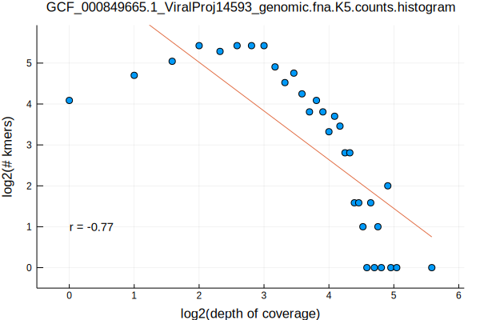
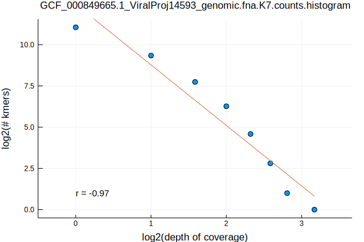
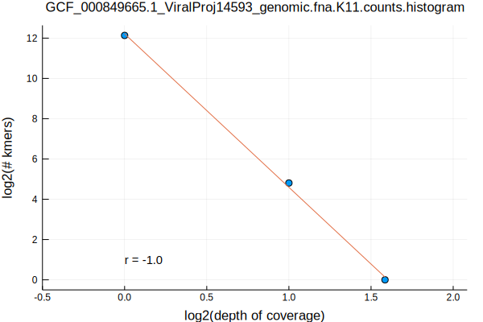
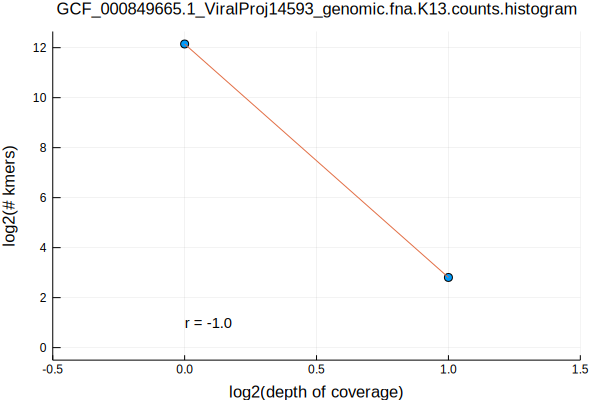
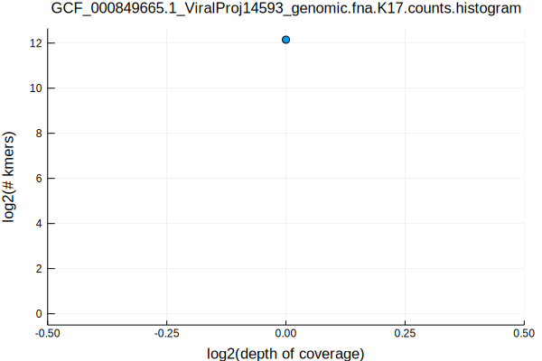

Following up with the second post in the kmer distributions series (see the [Selecting Genomes by Taxonomy](/selecting-genomes-by-taxonomy.html) and [Norwalk Virus Kmer Distributions](norwalk-virus-kmer-distributions.html) posts), we will now look at the Chlamydia Phage Chp2 kmer distributions using the same process as before

```bash
FASTA=GCF_000849665.1_ViralProj14593_genomic.fna
K_RANGE="5 7 11 13 17"
parallel Eisenia\ stream-kmers\ --k\ \{1\}\ --fasta\ $FASTA.gz\ \|\ LC_ALL=C\ sort\ --temporary-directory\ \.\ --compress-program\ gzip \|\ uniq\ --count\ \| gzip\ \>\ $FASTA.K\{1\}.counts.gz ::: $K_RANGE
parallel gzip\ --decompress\ --stdout\ $FASTA.K\{1\}.counts.gz\ \|\ awk\ \'\{print\ \$1\}\'\ \|\ LC_ALL=C\ sort\ --numeric\ \|\ uniq\ --count\ \>\ $FASTA.K\{1\}.counts.histogram ::: $K_RANGE
parallel Eisenia\ plot\ histogram\ --histogram\ $FASTA.K\{1\}.counts.histogram ::: $K_RANGE
mv $FASTA.K*.counts.histogram.svg ../../assets/images/
```







Similar to the patterns observed with the [Norwalk Virus](/norwalk-virus-kmer-distributions.html), k-lengths >= 7 result in a monotonically decreasing and nearly linear relationship between the logarithm of the kmer coverage and number of kmers with those coverages
