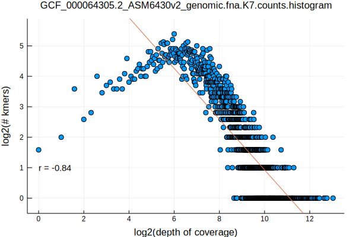
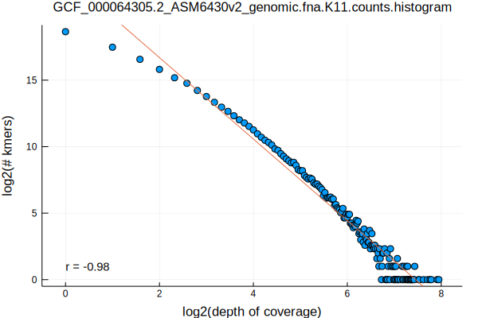
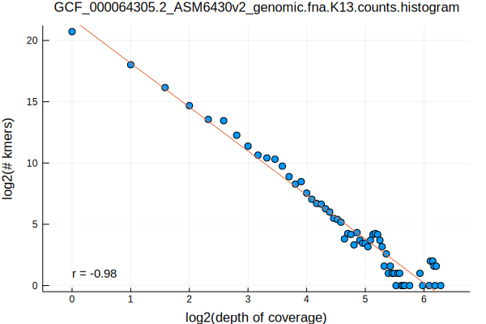
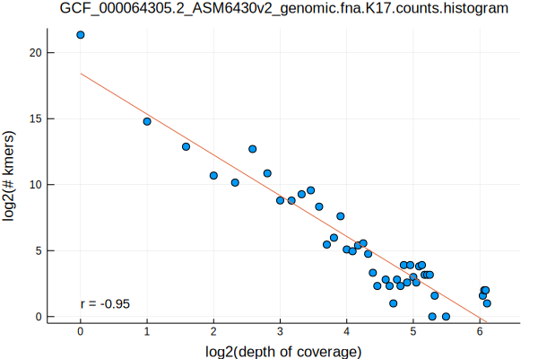
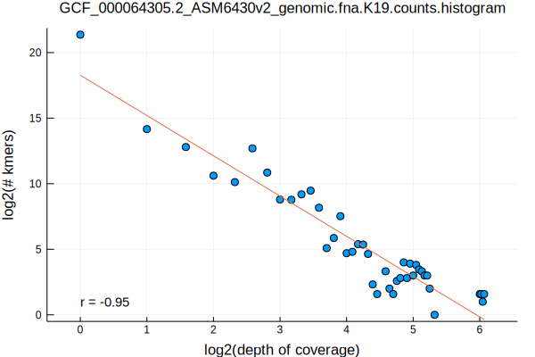
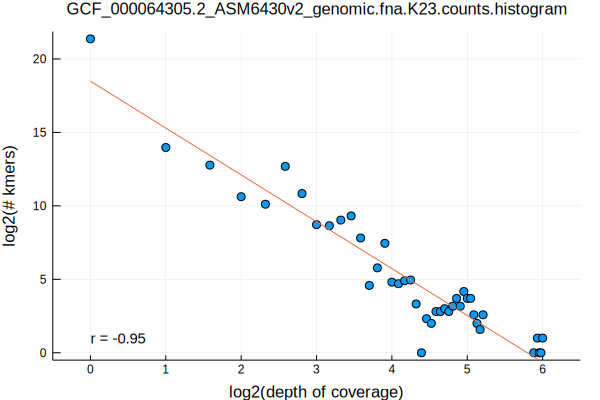
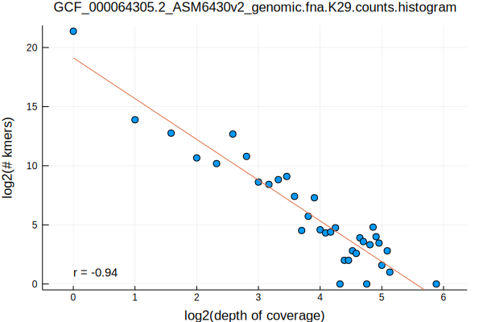
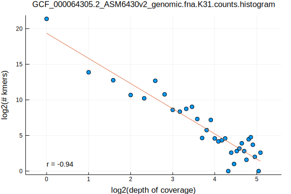

Having looked at the kmer distributions of a randomly selected [virus](/norwalk-virus-kmer-distributions.html) and [phage](/chlamydia-phage-chp2-kmer-distributions.html) from RefSeq in previous posts, we'll now look at a bacterium: Flavobacterium psychrophilum

```bash
FASTA=GCF_000064305.2_ASM6430v2_genomic.fna
K_RANGE="7 11 13 17 19 23 29 31"
parallel Eisenia\ stream-kmers\ --k\ \{1\}\ --fasta\ $FASTA.gz\ \|\ LC_ALL=C\ sort\ --temporary-directory\ \.\ --compress-program\ gzip \|\ uniq\ --count\ \| gzip\ \>\ $FASTA.K\{1\}.counts.gz ::: $K_RANGE
parallel gzip\ --decompress\ --stdout\ $FASTA.K\{1\}.counts.gz\ \|\ awk\ \'\{print\ \$1\}\'\ \|\ LC_ALL=C\ sort\ --numeric\ \|\ uniq\ --count\ \>\ $FASTA.K\{1\}.counts.histogram ::: $K_RANGE
parallel Eisenia\ plot\ histogram\ --histogram\ $FASTA.K\{1\}.counts.histogram ::: $K_RANGE
mv $FASTA.K*.counts.histogram.svg ../../assets/images/
```










Again, we can see a convergence to a log-log linear relationship, this time starting at k-lengths >= 11
