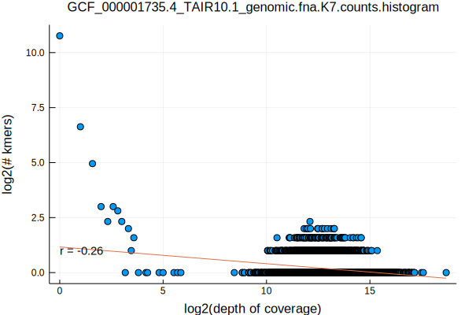
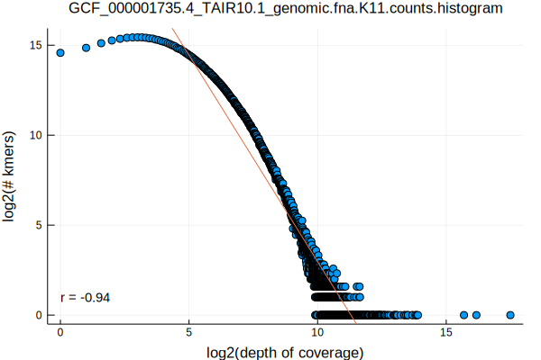
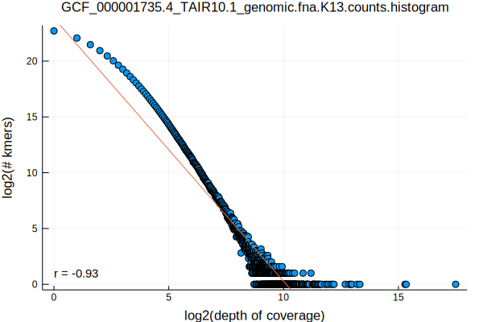
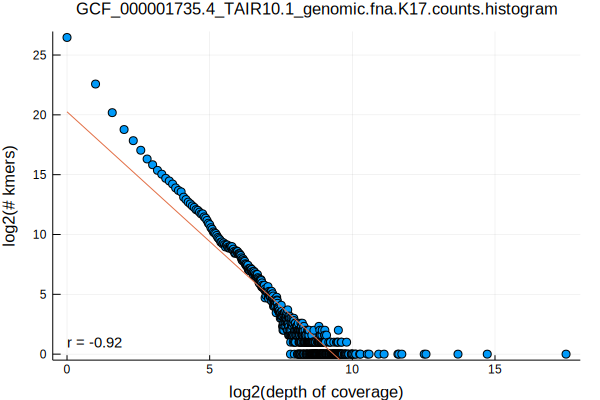
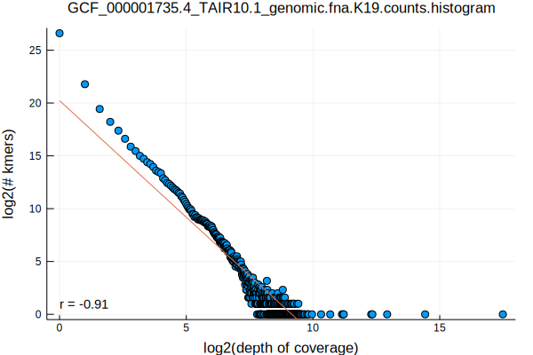
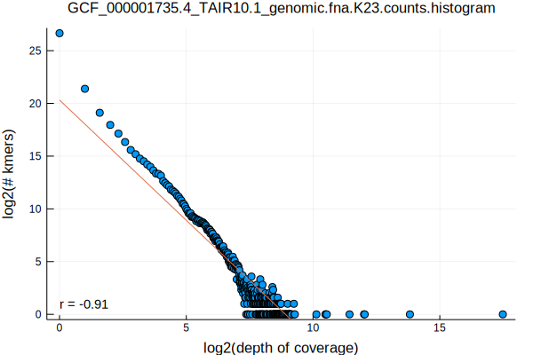
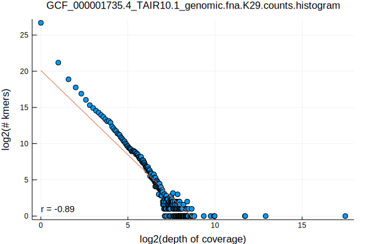
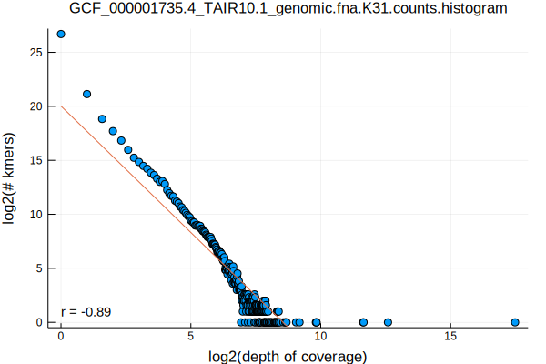

- part 1: [Selecting Genomes by Taxonomy](/selecting-genomes-by-taxonomy.html)
- part 2: [Norwalk Virus Kmer Distributions](/norwalk-virus-kmer-distributions.html)
- part 3: [Chlamydia Phage Chp2 Kmer Distributions](/chlamydia-phage-chp2-kmer-distributions.html)
- part 4: [Flavobacterium psychrophilum Kmer Distributions](/flavobacterium-psychrophilum-kmer-distributions.html)
- part 5: [Saccharomyces cerevisiae Kmer Distributions](/saccharomyces-cerevisiae-kmer-distributions.html)

```bash
FASTA=GCF_000001735.4_TAIR10.1_genomic.fna
K_RANGE="7 11 13 17 19 23 29 31"
parallel Eisenia\ stream-kmers\ --k\ \{1\}\ --fasta\ $FASTA.gz\ \|\ LC_ALL=C\ sort\ --temporary-directory\ \.\ --compress-program\ gzip \|\ uniq\ --count\ \| gzip\ \>\ $FASTA.K\{1\}.counts.gz ::: $K_RANGE
parallel gzip\ --decompress\ --stdout\ $FASTA.K\{1\}.counts.gz\ \|\ awk\ \'\{print\ \$1\}\'\ \|\ LC_ALL=C\ sort\ --numeric\ \|\ uniq\ --count\ \>\ $FASTA.K\{1\}.counts.histogram ::: $K_RANGE
parallel Eisenia\ plot\ histogram\ --histogram\ $FASTA.K\{1\}.counts.histogram ::: $K_RANGE
mv $FASTA.K*.counts.histogram.svg ../../assets/images/
```










For the commonly studied model mustard plant, Arabidopsis, it appears that k >= 13 results in a stable kmer frequency relationship. The two distinct patterns observed for k=7 is very interesting, and I'm not sure what kind of genomic element is resulting in the linear pattern on the left-hand side of the graph. My only two guesses are that the pattern is from a virus that integrated into the genome, or from the separate DNA genome of the chloroplast. We'll have to see if similar patterns are observed for other eukaryotic organisms that may also have integrated viruses in their genomes and/or mitochondrial DNA.

I think this is worth following up on with another post. It is possible to inspect the counts file to grab all 7mers with frequencies less than ~ 2^7, locating those kmers in the genome, and then looking to see if any useful annotations exist for those regions of the genome.
