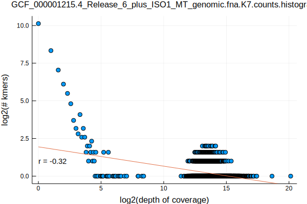
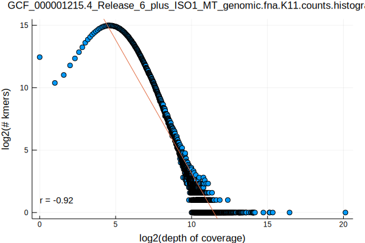
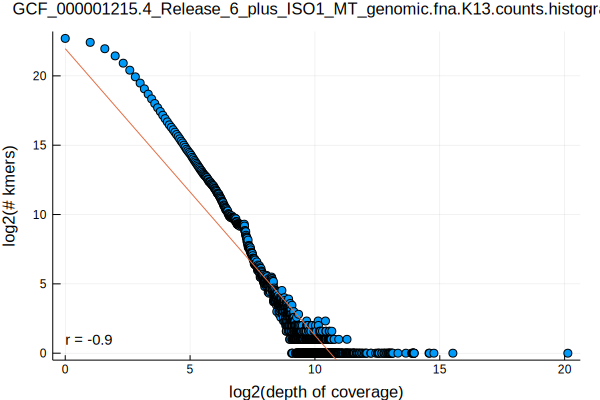
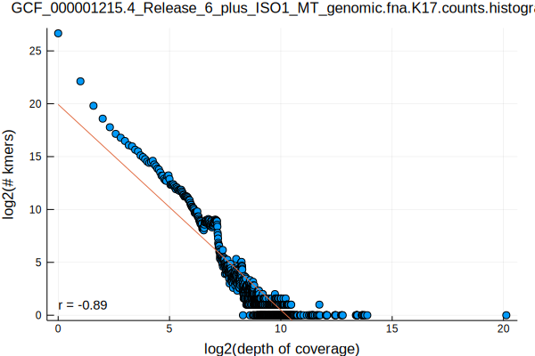
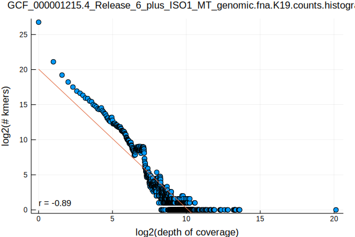
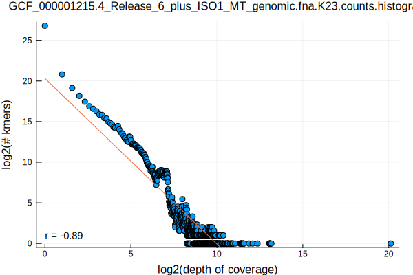
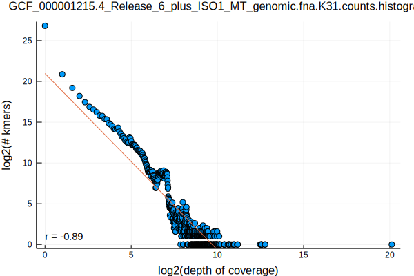

- part 1: [Selecting Genomes by Taxonomy](/selecting-genomes-by-taxonomy.html)
- part 2: [Norwalk Virus Kmer Distributions](/norwalk-virus-kmer-distributions.html)
- part 3: [Chlamydia Phage Chp2 Kmer Distributions](/chlamydia-phage-chp2-kmer-distributions.html)
- part 4: [Flavobacterium psychrophilum Kmer Distributions](/flavobacterium-psychrophilum-kmer-distributions.html)
- part 5: [Saccharomyces cerevisiae Kmer Distributions](/saccharomyces-cerevisiae-kmer-distributions.html)
- part 6: [Arabidopsis thaliana Kmer Distributions](/arabidopsis-thaliana-kmer-distributions.html)
- part 7: [Caenorhabditis elegans Kmer Distributions](/caenorhabditis-elegans-kmer-distributions.html)

```bash
FASTA=GCF_000001215.4_Release_6_plus_ISO1_MT_genomic.fna
K_RANGE="7 11 13 17 19 23 29 31"
parallel Eisenia\ stream-kmers\ --k\ \{1\}\ --fasta\ $FASTA.gz\ \|\ LC_ALL=C\ sort\ --temporary-directory\ \.\ --compress-program\ gzip \|\ uniq\ --count\ \| gzip\ \>\ $FASTA.K\{1\}.counts.gz ::: $K_RANGE
parallel gzip\ --decompress\ --stdout\ $FASTA.K\{1\}.counts.gz\ \|\ awk\ \'\{print\ \$1\}\'\ \|\ LC_ALL=C\ sort\ --numeric\ \|\ uniq\ --count\ \>\ $FASTA.K\{1\}.counts.histogram ::: $K_RANGE
parallel Eisenia\ plot\ histogram\ --histogram\ $FASTA.K\{1\}.counts.histogram ::: $K_RANGE
mv $FASTA.K*.counts.histogram.svg ../../assets/images/
```










We're again seeing a dual distribution at k=7 similar to what was observed in [Arabidopsis thaliana](/arabidopsis-thaliana-kmer-distributions.html) and a relatively stable distribution for k>=17 with a strange bump around 2^7 depth of coverage
