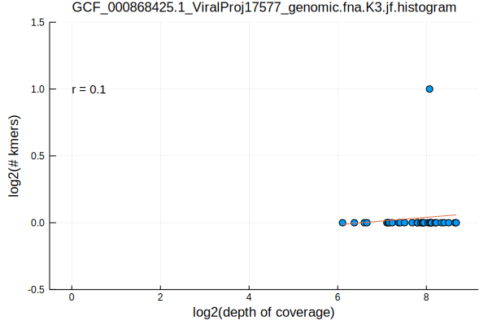
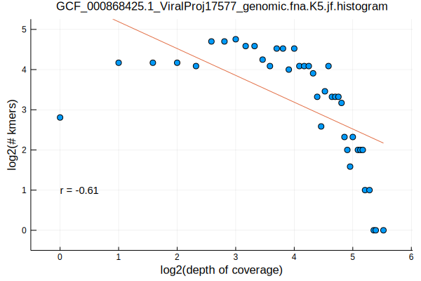
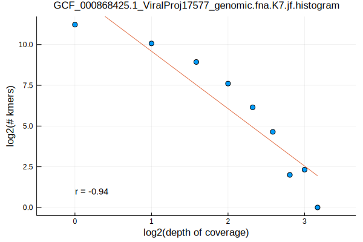
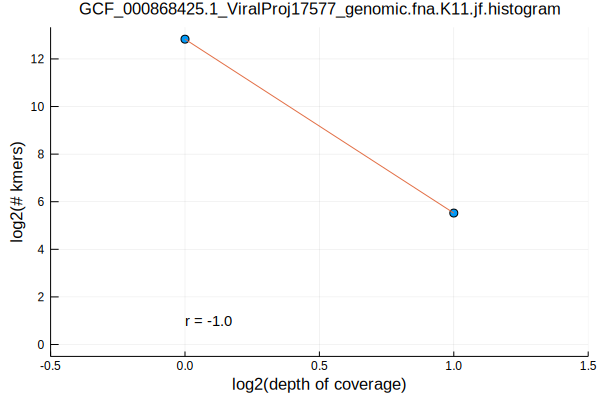
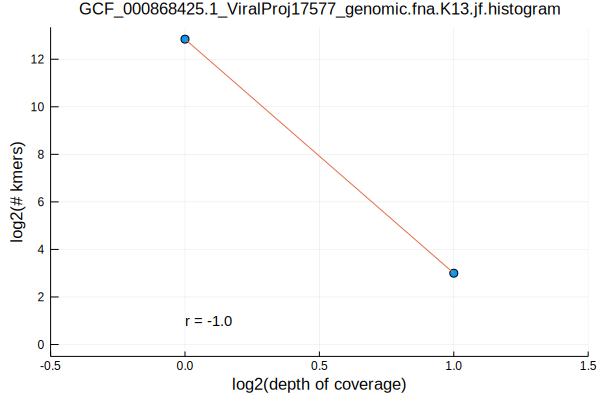
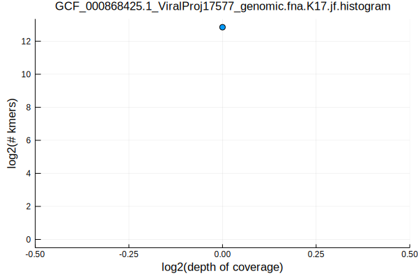

In a [previous post](/selecting-genomes-by-taxonomy.html) we integrated taxonomic information with the RefSeq reference genomes to select a set of representative genomes from each taxonomic category. In this post, we will evaluate the kmer frequency profiles of the selected virus, the Norwalk virus. 

The first step in analyzing the frequency of kmers is to first determine all of the kmers in a genome. This can be done by simply starting at the beginning of the genome and then returning each k-length slice from the genome. If the genome is composed of multiple chromosomes, then the process is the same, but it is done chromosome by chromosome. Depending on the context of the question you are interested in, you may wish to review the kmers as they are actually observed, or you may wish to convert all kmers to their canonical form. The canonical form is formal terminology for whichever orientation is alphabetically first.

In general, I prefer to use k-lengths that are prime. There are two reasons for this. The first is that using odd-length kmers removes the ability for kmers to be equivalent to their reverse complements. For example, the kmer `AT` in the forward direction is also `AT` in the reverse complement direction, but the kmer `ATA` is `TAT` in the reverse complement direction, thus breaking the equivalence. The second reason is that utilizing prime-number k-lengths breaks up common 3-mer patterns. For example, if there is a repetitive genomic element of length 9 such as `AAATTTAAA` that translates to a commonly used sequence of amino acids, it might be observed many times in the genome. In order to break up these naturally occurring patterns we'd be better off utilizing a prime number k-length such as 11 that may help us better identify the unique genomic location of the sequence we are evaluating.

```bash
FASTA=GCF_000868425.1_ViralProj17577_genomic.fna
K_RANGE="3 5 7 11 13 17"
parallel jellyfish\ count\ --canonical\ --mer-len\ \{\}\ --threads\ 1\ --size\ 100M\ --output\ $FASTA.K\{\}.jf\ \<\(gzip\ -dc\ $FASTA.gz\) ::: $K_RANGE
parallel jellyfish\ histo\ --high\ \$\(jellyfish\ dump\ $FASTA.K\{\}.jf\ \|\ grep\ \"\^\>\"\ \|\ sed\ \'s/\>//\'\ \|\ sort\ --numeric-sort\ --reverse\ \|\ head\ -n1\)\ $FASTA.K\{\}.jf\ \>\ $FASTA.K\{1\}.jf.histogram ::: $K_RANGE
parallel Eisenia\ plot\ histogram\ --histogram\ $FASTA.K\{1\}.jf.histogram ::: $K_RANGE
mv $FASTA.K*.jf.histogram.svg ../../assets/images/
```

And here are the results. While this single genome doesn't give a great representation for how all genomes behave, you will notice that after a certain k-length, a linear relationship develops between the `log(# of kmers) ~ log(coverage)` before the k-length gets so large that all kmers become unique.







