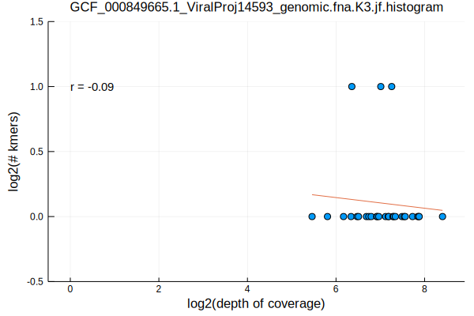
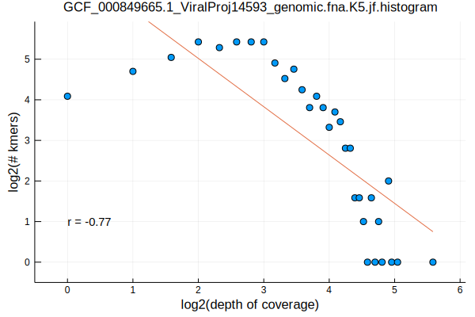
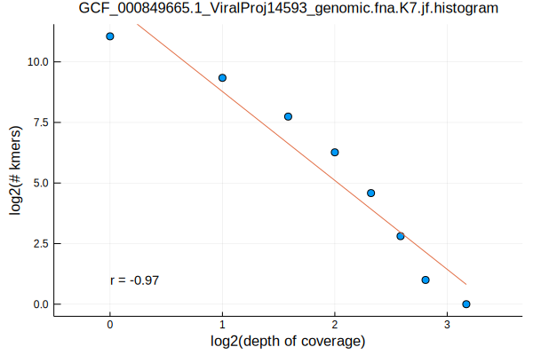
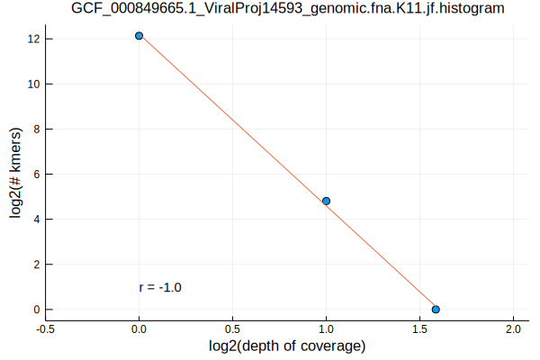
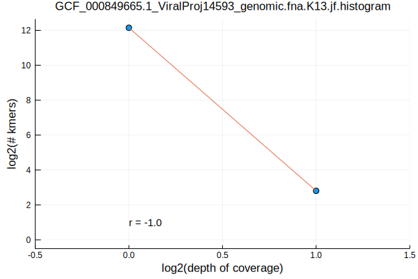
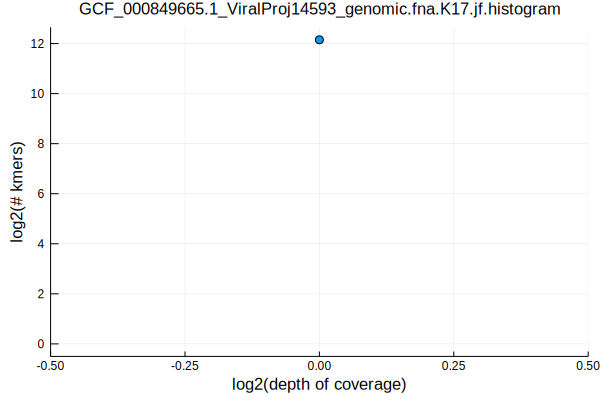

layout: post  
title: Chlamydia Phage Chp2 Kmer Distributions  
date: 2019-08-30  
author: Cameron Prybol  

---

Following up with the second post in the kmer distributions series (see the [Selecting Genomes by Taxonomy](/selecting-genomes-by-taxonomy.html) and [Norwalk Virus Kmer Distributions](norwalk-virus-kmer-distributions.html) posts), we will now look at the Chlamydia Phage Chp2 kmer distributions using the same process as before

```bash
FASTA=GCF_000849665.1_ViralProj14593_genomic.fna
K_RANGE="3 5 7 11 13 17"
parallel jellyfish\ count\ --canonical\ --mer-len\ \{\}\ --threads\ 1\ --size\ 100M\ --output\ $FASTA.K\{\}.jf\ \<\(gzip\ -dc\ $FASTA.gz\) ::: $K_RANGE
parallel jellyfish\ histo\ --high\ \$\(jellyfish\ dump\ $FASTA.K\{\}.jf\ \|\ grep\ \"\^\>\"\ \|\ sed\ \'s/\>//\'\ \|\ sort\ --numeric-sort\ --reverse\ \|\ head\ -n1\)\ $FASTA.K\{\}.jf\ \>\ $FASTA.K\{1\}.jf.histogram ::: $K_RANGE
parallel Eisenia\ plot\ histogram\ --histogram\ $FASTA.K\{1\}.jf.histogram ::: $K_RANGE
mv $FASTA.K*.jf.histogram.svg ../../assets/images/
```








Similar to the patterns observed with the [Norwalk Virus](/norwalk-virus-kmer-distributions.html), k-lengths >= 7 result in a monotonically decreasing and nearly linear relationship between the logarithm of the kmer coverage and number of kmers with those coverages
