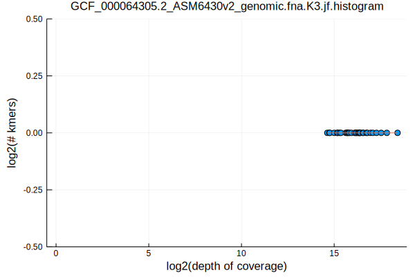
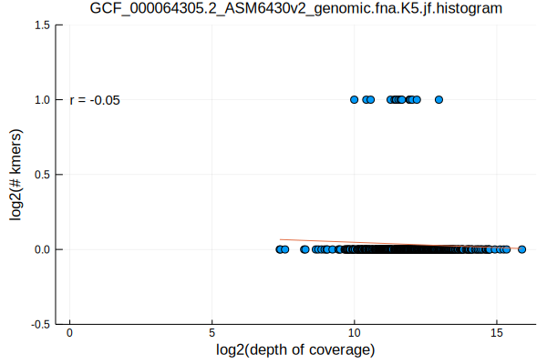
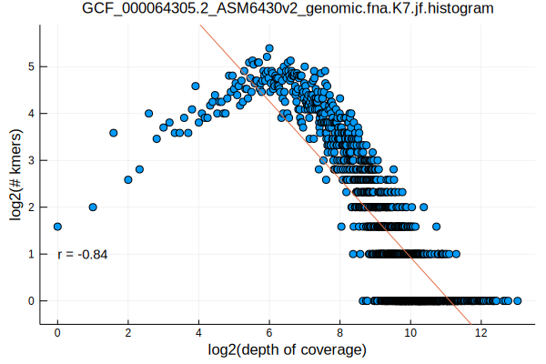
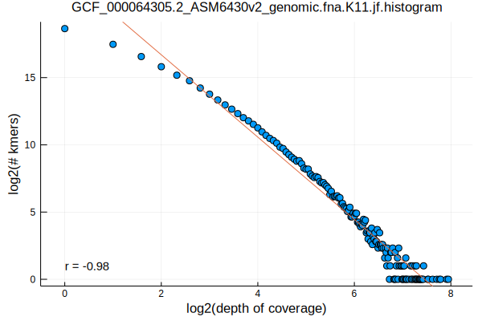
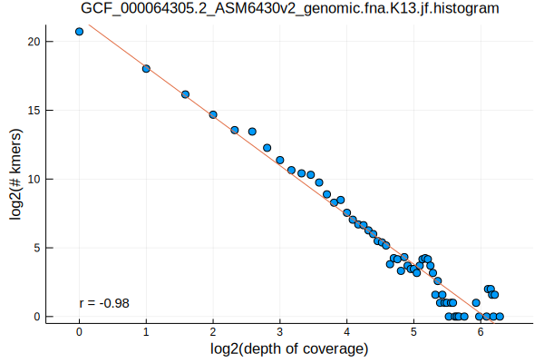
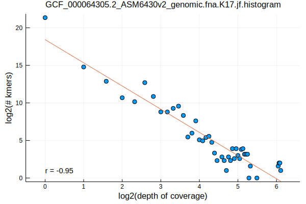
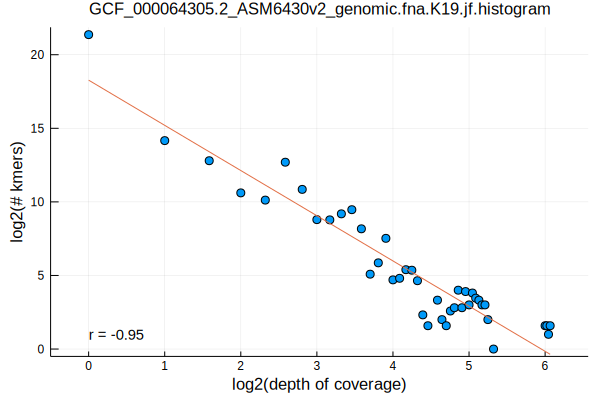
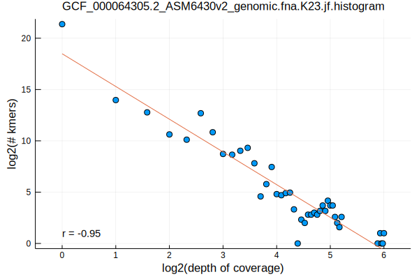

Having looked at the kmer distributions of a randomly selected [virus](/norwalk-virus-kmer-distributions.html) and [phage](/chlamydia-phage-chp2-kmer-distributions.html) from RefSeq in previous posts, we'll now look at a bacterium: Flavobacterium psychrophilum

```bash
FASTA=GCF_000064305.2_ASM6430v2_genomic.fna
K_RANGE="3 5 7 11 13 17 19 23"
parallel jellyfish\ count\ --canonical\ --mer-len\ \{\}\ --threads\ 1\ --size\ 100M\ --output\ $FASTA.K\{\}.jf\ \<\(gzip\ -dc\ $FASTA.gz\) ::: $K_RANGE
parallel jellyfish\ histo\ --high\ \$\(jellyfish\ dump\ $FASTA.K\{\}.jf\ \|\ grep\ \"\^\>\"\ \|\ sed\ \'s/\>//\'\ \|\ sort\ --numeric-sort\ --reverse\ \|\ head\ -n1\)\ $FASTA.K\{\}.jf\ \>\ $FASTA.K\{1\}.jf.histogram ::: $K_RANGE
parallel Eisenia\ plot\ histogram\ --histogram\ $FASTA.K\{1\}.jf.histogram ::: $K_RANGE
mv $FASTA.K*.jf.histogram.svg ../../assets/images/
```










Again, we can see a convergence to a log-log linear relationship, this time starting at k-lengths >= 11
