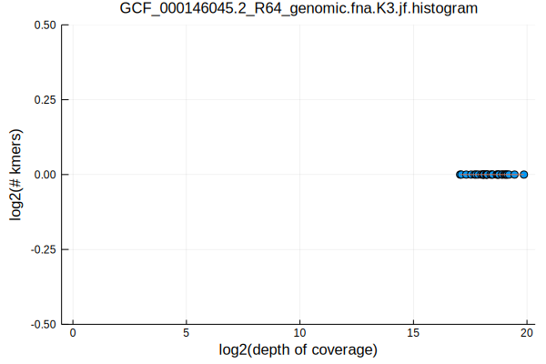
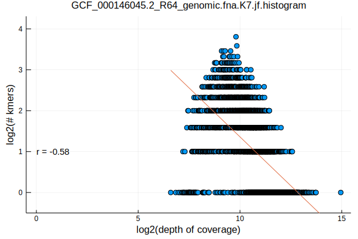
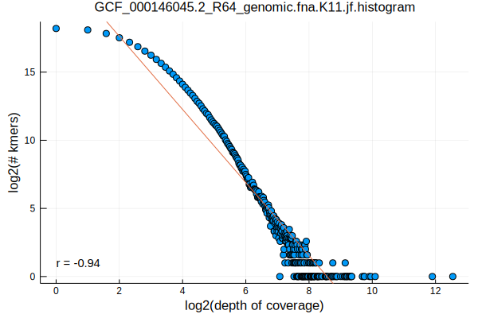
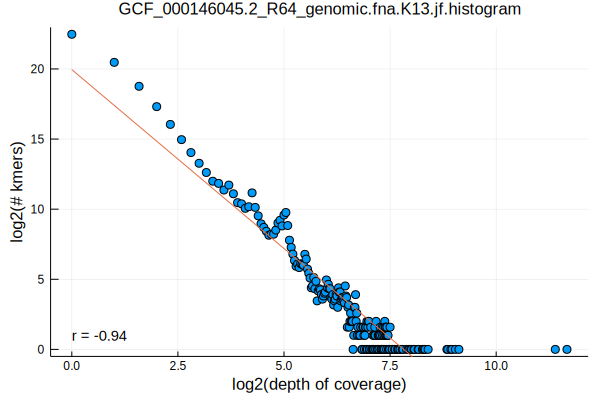
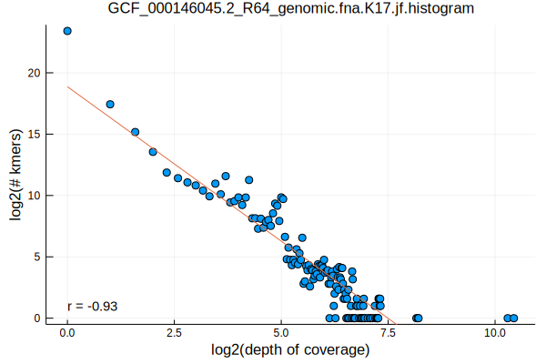
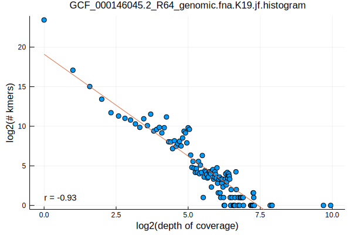
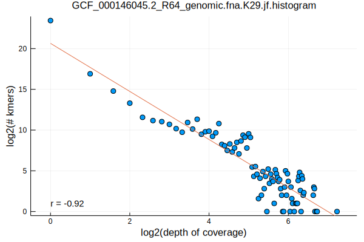
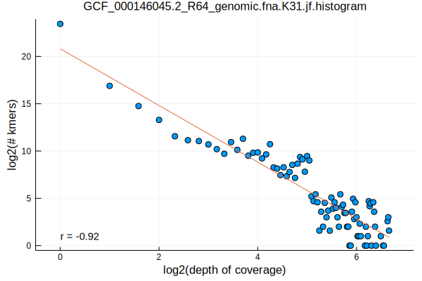

- part 1: [Selecting Genomes by Taxonomy](/selecting-genomes-by-taxonomy.html)
- part 2: [Norwalk Virus Kmer Distributions](/norwalk-virus-kmer-distributions.html)
- part 3: [Chlamydia Phage Chp2 Kmer Distributions](/chlamydia-phage-chp2-kmer-distributions.html)
- part 4: [Flavobacterium psychrophilum Kmer Distributions](/flavobacterium-psychrophilum-kmer-distributions.html)

Here, we will be looking at our first eukaryotic organism with multiple chromosomes, Saccharomyces cerevisiae. More commonly known as yeast, it is loved by bakers, brewers, winemakers, and researchers alike!

```bash
FASTA=GCF_000146045.2_R64_genomic.fna
K_RANGE="3 5 7 11 13 17 19 23 29 31"
parallel jellyfish\ count\ --canonical\ --mer-len\ \{\}\ --threads\ 1\ --size\ 100M\ --output\ $FASTA.K\{\}.jf\ \<\(gzip\ -dc\ $FASTA.gz\) ::: $K_RANGE
parallel jellyfish\ histo\ --high\ \$\(jellyfish\ dump\ $FASTA.K\{\}.jf\ \|\ grep\ \"\^\>\"\ \|\ sed\ \'s/\>//\'\ \|\ sort\ --numeric-sort\ --reverse\ \|\ head\ -n1\)\ $FASTA.K\{\}.jf\ \>\ $FASTA.K\{1\}.jf.histogram ::: $K_RANGE
parallel Eisenia\ plot\ histogram\ --histogram\ $FASTA.K\{1\}.jf.histogram ::: $K_RANGE
mv $FASTA.K*.jf.histogram.svg ../../assets/images/
```












We again see the log-log relationship described earlier, with a monotonically decreasing pattern observed for k >= 11, a stable pattern observed for k >= 13, and with some high coverage outliers (repetitive kmers) that are prominent in the data until k >= 29 when their repetitive structure is broken by including additional information from neighboring sequence.
