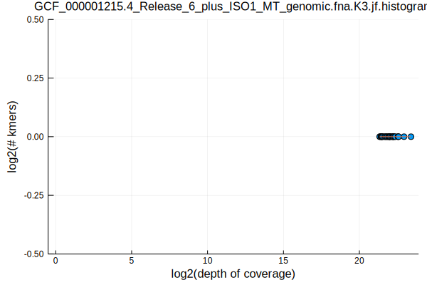
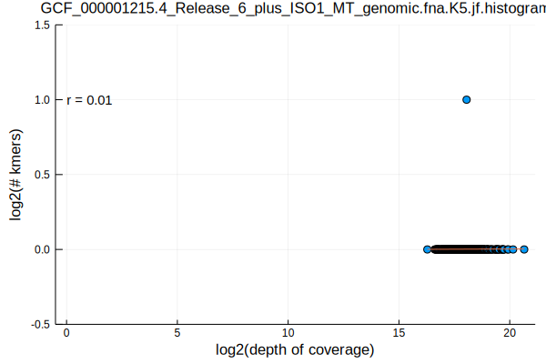
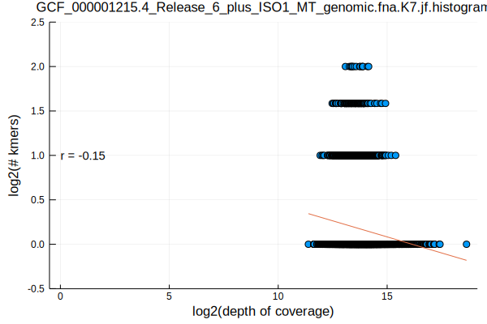
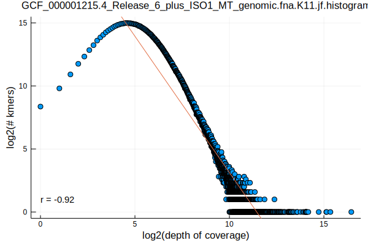
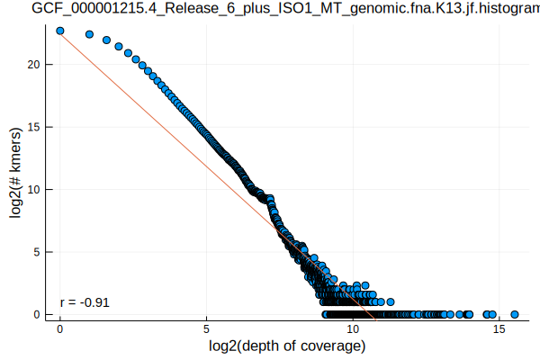
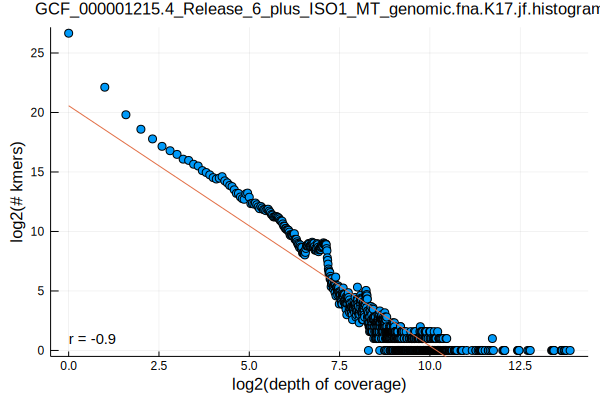
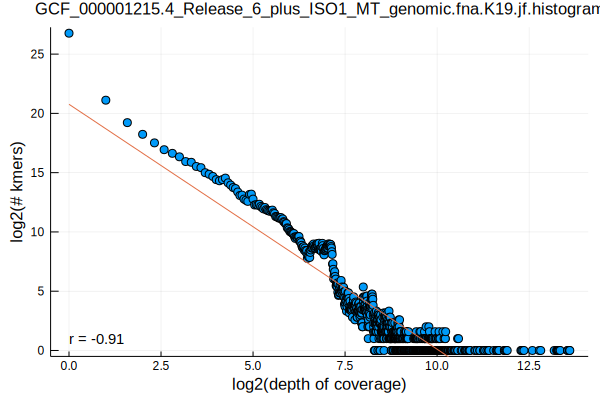
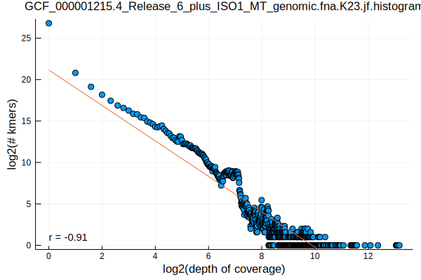
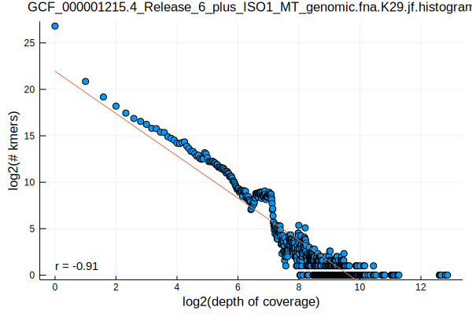
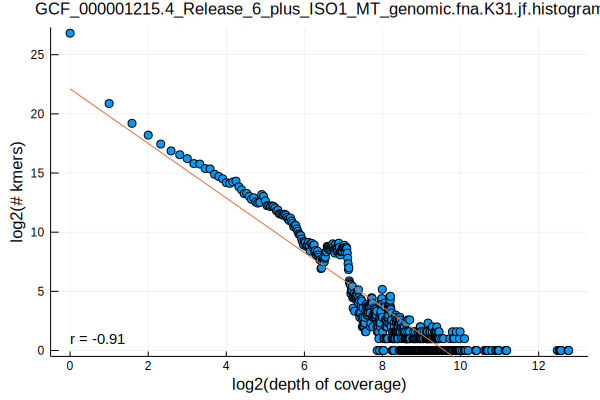

- part 1: [Selecting Genomes by Taxonomy](/selecting-genomes-by-taxonomy.html)
- part 2: [Norwalk Virus Kmer Distributions](/norwalk-virus-kmer-distributions.html)
- part 3: [Chlamydia Phage Chp2 Kmer Distributions](/chlamydia-phage-chp2-kmer-distributions.html)
- part 4: [Flavobacterium psychrophilum Kmer Distributions](/flavobacterium-psychrophilum-kmer-distributions.html)
- part 5: [Saccharomyces cerevisiae Kmer Distributions](/saccharomyces-cerevisiae-kmer-distributions.html)
- part 6: [Arabidopsis thaliana Kmer Distributions](/arabidopsis-thaliana-kmer-distributions.html)
- part 7: [Caenorhabditis elegans Kmer Distributions](/caenorhabditis-elegans-kmer-distributions.html)

```bash
FASTA=GCF_000001215.4_Release_6_plus_ISO1_MT_genomic.fna
K_RANGE="3 5 7 11 13 17 19 23 29 31"
parallel jellyfish\ count\ --disk --canonical\ --mer-len\ \{\}\ --threads\ 1\ --size\ 100M\ --output\ $FASTA.K\{\}.jf\ \<\(gzip\ -dc\ $FASTA.gz\) ::: $K_RANGE
parallel jellyfish\ histo\ --high\ \$\(jellyfish\ dump\ $FASTA.K\{\}.jf\ \|\ grep\ \"\^\>\"\ \|\ sed\ \'s/\>//\'\ \|\ awk\ \'BEGIN\{max\=0\}\;\{if\(\$1\>max\)\ max\=\$1\}\;END\{print\ max\}\'\)\ $FASTA.K\{\}.jf\ \>\ $FASTA.K\{1\}.jf.histogram ::: $K_RANGE
parallel Eisenia\ plot\ histogram\ --histogram\ $FASTA.K\{1\}.jf.histogram ::: $K_RANGE
mv $FASTA.K*.jf.histogram.svg ../../assets/images/
```












We're again seeing a relatively stable distribution for k>=13 with a strange bump around 2^7 depth of coverage
